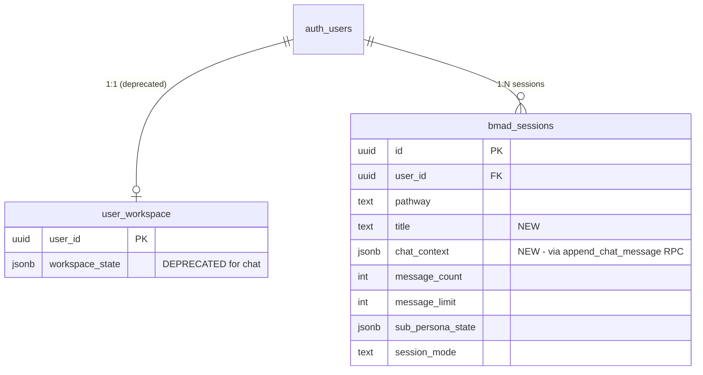

# Per-Session Isolated Data Model

## Enhancement Summary

**Deepened on:** 2026-03-16
**Agents used:** TypeScript Reviewer, Security Sentinel, Performance Oracle, Architecture Strategist, Code Simplicity Reviewer, Data Migration Expert, Supabase Best Practices Researcher

### Key Improvements Over Original Plan
1. **Split migration into schema (022) + data (023)** for failure isolation. If data migration fails, schema is still applied and you can retry.
2. **Create `append_chat_message` RPC** for atomic O(1) appends. Eliminates both the JSONB read-modify-write performance problem AND the concurrent write race condition.
3. **Delete `Workspace` interface entirely.** Use session row type directly. No adapter layer.
4. **Add DELETE RLS policy** on `bmad_sessions`. Currently missing, which means delete is both broken and unprotected.
5. **Dashboard must `SELECT` specific columns, not `*`.** Otherwise every session card loads the entire chat_context blob (potentially 600KB+ per session).
6. **Export route (`/api/chat/export`) is missing from the plan.** It reads from `user_workspace` and would serve stale data.
7. **Add `parseChatContext()` validator** at the JSONB read boundary. Supabase types JSONB as `Json | null` (effectively `any`).
8. **Guard migration SQL against malformed guest data** with `jsonb_typeof` check.

### New Risks Discovered
- No RLS DELETE policy on `bmad_sessions` (delete is broken AND unprotected)
- `useStreamingChat` hook has no access to `user.id` (needed for IDOR checks on writes)
- `INITCAP` produces "Board Of Directors" instead of "Board of Directors"
- Proposed composite index `(id, user_id)` is redundant with PK. Need `(user_id, updated_at DESC)` instead.
- Messages written between code deploy and code revert would be lost from user perspective

---

## Overview

The session page ignores the URL's session ID and loads a single `user_workspace` row for every user. All sessions share one chat history. This refactor gives each session its own chat, making the data model match the UI (dashboard shows separate session cards with distinct titles and dates).

## Problem Statement

| What should happen | What actually happens |
|---|---|
| `/app/session/abc123` loads chat from session `abc123` | Loads chat from `user_workspace` for the user (same data regardless of session ID) |
| Each session has its own chat history | All sessions share ONE `chat_context` array in `user_workspace.workspace_state` |
| Dashboard shows session titles | Shows "Untitled Session" (no `title` column on `bmad_sessions`) |
| Deleting a session removes its chat | Deleting removes `bmad_sessions` row only; chat in `user_workspace` untouched |
| Creating a new session starts fresh | New session sees the accumulated chat from `user_workspace` |

**Root cause:** The app was built with a "one workspace per user" model but the UI evolved to show multiple sessions. The data layer never caught up.

## Proposed Solution

1. Add `chat_context JSONB`, `title TEXT` columns + `append_chat_message` RPC + DELETE RLS policy
2. Session page fetches `bmad_sessions` by `params.id + user.id`, delete `Workspace` interface
3. `useStreamingChat` uses `append_chat_message` RPC for atomic writes, sends `sessionId` to API
4. Chat stream API + export API route validate `sessionId` ownership
5. Dashboard reads `title`, selects only needed columns (excludes `chat_context`)
6. Guest migration targets `bmad_sessions` with correct `ChatMessage[]` shape

## Technical Approach

### Phase 1: Migrations (Schema + Data + RPC)

Split into two migrations for failure isolation.

**File:** `apps/web/supabase/migrations/022_per_session_chat_schema.sql` (NEW)

```sql
-- Migration 022: Per-session chat isolation (schema only)

-- Add chat storage and title to bmad_sessions
ALTER TABLE bmad_sessions
  ADD COLUMN IF NOT EXISTS chat_context JSONB DEFAULT '[]'::jsonb,
  ADD COLUMN IF NOT EXISTS title TEXT;

-- RPC for atomic message append (eliminates read-modify-write race condition)
CREATE OR REPLACE FUNCTION append_chat_message(p_session_id UUID, p_user_id UUID, p_message JSONB)
RETURNS void
LANGUAGE sql
SECURITY DEFINER
AS $$
  UPDATE bmad_sessions
  SET chat_context = chat_context || jsonb_build_array(p_message),
      updated_at = now()
  WHERE id = p_session_id
    AND user_id = p_user_id;
$$;

-- Missing DELETE policy (currently only SELECT, INSERT, UPDATE exist)
CREATE POLICY "Users can delete their own BMad sessions" ON bmad_sessions
  FOR DELETE USING (auth.uid() = user_id);

-- Dashboard query index (replaces the redundant PK-duplicate proposed earlier)
CREATE INDEX IF NOT EXISTS idx_bmad_sessions_user_dashboard
  ON bmad_sessions(user_id, updated_at DESC);

COMMENT ON TABLE user_workspace IS 'DEPRECATED for chat as of migration 022. Chat now in bmad_sessions.chat_context.';
```

**File:** `apps/web/supabase/migrations/023_per_session_chat_data.sql` (NEW)

```sql
-- Migration 023: One-time data migration from user_workspace to bmad_sessions
-- Separate from schema for failure isolation. Can be re-run if needed.

-- Copy chat to most recent active session per user
-- Guards against malformed guest migration data with jsonb_typeof check
WITH latest_sessions AS (
  SELECT DISTINCT ON (user_id) id, user_id
  FROM bmad_sessions
  WHERE status = 'active'
  ORDER BY user_id, created_at DESC
)
UPDATE bmad_sessions bs
SET chat_context = COALESCE(
  CASE
    WHEN jsonb_typeof(uw.workspace_state->'chat_context') = 'array'
    THEN uw.workspace_state->'chat_context'
    ELSE '[]'::jsonb
  END,
  '[]'::jsonb
)
FROM latest_sessions ls
JOIN user_workspace uw ON uw.user_id = bs.user_id
WHERE bs.id = ls.id
  AND bs.user_id = ls.user_id;

-- Set titles using exact pathway names (not INITCAP which produces "Board Of Directors")
UPDATE bmad_sessions
SET title = CASE pathway
  WHEN 'quick-decision' THEN 'Quick Decision'
  WHEN 'deep-analysis' THEN 'Deep Analysis'
  WHEN 'board-of-directors' THEN 'Board of Directors'
  WHEN 'strategy-sprint' THEN 'Strategy Sprint'
  WHEN 'new-idea' THEN 'New Idea'
  WHEN 'business-model' THEN 'Business Model'
  WHEN 'strategic-optimization' THEN 'Strategic Optimization'
  ELSE INITCAP(REPLACE(pathway, '-', ' '))
END
WHERE title IS NULL;

-- Verification queries (inspect output in migration logs)
SELECT 'sessions_with_migrated_chat' AS metric, COUNT(*) AS value
FROM bmad_sessions WHERE chat_context != '[]'::jsonb;

SELECT 'orphaned_chat_users' AS metric, COUNT(*) AS value
FROM user_workspace uw
WHERE jsonb_typeof(uw.workspace_state->'chat_context') = 'array'
  AND jsonb_array_length(uw.workspace_state->'chat_context') > 0
  AND NOT EXISTS (
    SELECT 1 FROM bmad_sessions bs WHERE bs.user_id = uw.user_id AND bs.status = 'active'
  );

SELECT 'malformed_chat_context' AS metric, COUNT(*) AS value
FROM bmad_sessions WHERE chat_context IS NOT NULL AND jsonb_typeof(chat_context) != 'array';
```

### Research Insights (Phase 1)

**Migration Safety (Data Migration Expert):**
- `ADD COLUMN ... DEFAULT` on Postgres 11+ is metadata-only, no row rewrite. Safe for any table size.
- Split schema + data into two files. If data UPDATE fails, schema is marked applied but data migration can be retried as a separate file.
- `INITCAP` produces "Board Of Directors" (capitalizes every word). Use explicit CASE instead.

**Performance (Performance Oracle):**
- The `append_chat_message` RPC makes writes O(1) for the message payload instead of O(n) for the full history. Also eliminates the race condition because there's no read-modify-write.
- The proposed composite index `(id, user_id)` is redundant with the PK. The dashboard query needs `(user_id, updated_at DESC)` instead.

**Security (Security Sentinel):**
- No DELETE policy exists on `bmad_sessions`. Add it in the migration.
- The RPC uses `SECURITY DEFINER` with `user_id` check to prevent abuse.

---

### Phase 2: Session page + useStreamingChat (fetch and write per-session)

**Files:** `apps/web/app/app/session/[id]/page.tsx`, `apps/web/app/app/session/[id]/useStreamingChat.ts`

**2a. Delete the `Workspace` interface.** Replace with a `SessionData` type derived from the query:

```typescript
// Replace the hand-written Workspace interface with:
interface SessionData {
  id: string
  user_id: string
  chat_context: ChatMessage[]
  title: string | null
  pathway: string
  current_phase: string
  message_count: number
  message_limit: number
  sub_persona_state: BoardState | null
  session_mode: string | null
}
```

**2b. Replace `fetchWorkspace()` with `fetchSession()`:**

```typescript
const { data: session, error: fetchError } = await supabase
  .from('bmad_sessions')
  .select('id, user_id, chat_context, title, pathway, current_phase, message_count, message_limit, sub_persona_state, session_mode, updated_at')
  .eq('id', params.id)
  .eq('user_id', user.id)
  .single()
```

**2c. Add `parseChatContext()` validator** at the JSONB read boundary:

```typescript
function parseChatContext(raw: unknown): ChatMessage[] {
  if (!Array.isArray(raw)) return []
  return raw.filter((msg): msg is ChatMessage =>
    typeof msg === 'object' && msg !== null &&
    'id' in msg && 'role' in msg && 'content' in msg && 'timestamp' in msg
  )
}
```

**2d. `useStreamingChat` changes:**

- Accept `userId: string` parameter (hook currently has no access to auth user ID, needed for IDOR)
- Use `append_chat_message` RPC instead of full JSONB rewrite:

```typescript
// BEFORE: read-modify-write (O(n), race-prone)
await supabase.from('user_workspace').update({ workspace_state: { ...current, chat_context: updated } })

// AFTER: atomic append (O(1), race-free)
await supabase.rpc('append_chat_message', {
  p_session_id: current.id,
  p_user_id: userId,
  p_message: newMessage,
})
```

- Send `sessionId` instead of `workspaceId` to the stream API
- Seed `boardState` from `session.sub_persona_state` on initial load

**2e. Remove dead code from session page:**

- Delete `StateBridge` render (hidden, unused store)
- Delete `CanvasContextSync` render (behind unset feature flag)
- Delete `canvasState`, `canvasContainerRef` state variables
- Delete canvas right-pane code (~80 lines)
- Remove imports: `StateBridge`, `CanvasContextSync`, `EnhancedCanvasWorkspace`, `dynamic`

### Research Insights (Phase 2)

**TypeScript (TypeScript Reviewer):**
- No Supabase generated types exist. Create them with `supabase gen types typescript --linked` after migration. Replace hand-written interfaces with derived types.
- JSONB columns are typed as `Json | null` by Supabase. The `parseChatContext()` validator is required.
- Fix the 9 `as any` casts in `useStreamingChat.ts` (all cast `string` to `BoardMemberId`). Add `isBoardMemberId` type guard.

**Simplicity (Code Simplicity Reviewer):**
- Kill the `Workspace` interface, don't adapt it. The `description` and `canvas_elements` fields are synthetic/empty.
- Remove StateBridge and CanvasContextSync. Canvas is behind an unset flag, both are dead code.
- `WorkspaceContext.tsx` is mounted in layout.tsx but `useWorkspace()` is never called. Delete the file.

**Architecture (Architecture Strategist):**
- Client-side message persistence is architecturally concerning but changing the write path (client vs server) is out of scope. The `append_chat_message` RPC is a pragmatic middle ground.
- `ExportPanel` receives `workspaceId` which needs to switch to `sessionId`.

---

### Phase 3: Chat stream API + Export API route

**Files:** `apps/web/app/api/chat/stream/route.ts`, `apps/web/app/api/chat/export/route.ts`

**3a. Chat stream route accepts `sessionId`:**

```typescript
const { message, sessionId, conversationHistory } = await req.json()

// Validate UUID format before querying
if (!sessionId || typeof sessionId !== 'string') {
  return new Response('Missing sessionId', { status: 400 })
}

// Verify session ownership
const { data: session, error } = await supabase
  .from('bmad_sessions')
  .select('id, user_id, pathway, current_phase, message_count, message_limit, sub_persona_state, session_mode')
  .eq('id', sessionId)
  .eq('user_id', user.id)
  .single()

if (error || !session) {
  return new Response('Session not found', { status: 404 })
}
```

**3b. Remove the "find or create session" lookup.** The current code finds the most recent active session and auto-creates if missing. This is the wrong-session bug. Replace with direct use of the validated session.

**3c. Export route reads from `bmad_sessions`:**

```typescript
// BEFORE: reads from user_workspace
const { data } = await supabase.from('user_workspace').select('workspace_state').eq('user_id', user.id).single()

// AFTER: reads from bmad_sessions by session ID
const { data: session } = await supabase
  .from('bmad_sessions')
  .select('chat_context, title')
  .eq('id', sessionId)
  .eq('user_id', user.id)
  .single()
```

### Research Insights (Phase 3)

**Security (Security Sentinel):**
- Pre-existing IDOR in stream route: `workspaceId` from client is never verified against `user.id`. This refactor fixes it.
- Thread `user.id` into `useStreamingChat` so writes include IDOR protection.
- Follow-up: read conversation history server-side from `bmad_sessions.chat_context` instead of trusting client-supplied `conversationHistory`.

---

### Phase 4: Dashboard, session creation, guest migration, cleanup

**Files:** `apps/web/app/app/page.tsx`, `apps/web/app/app/new/page.tsx`, `apps/web/lib/guest/session-migration.ts`, `apps/web/lib/workspace/WorkspaceContext.tsx`

**4a. Dashboard: select specific columns, read `title`:**

```typescript
// CRITICAL: exclude chat_context from dashboard query
// Otherwise every session card loads the full JSONB blob (potentially 600KB+ per session)
const { data: sessions } = await supabase
  .from('bmad_sessions')
  .select('id, user_id, pathway, title, current_phase, session_mode, message_count, message_limit, status, created_at, updated_at')
  .eq('user_id', user?.id)
  .order('updated_at', { ascending: false })
```

**4b. Fix `getSessionTitle()` and `getSessionDescription()`:**

```typescript
const getSessionTitle = (session: BmadSession) => session.title || 'Untitled Session'
const getSessionDescription = (session: BmadSession) => session.pathway?.replace(/-/g, ' ') || ''
```

**4c. Add `user_id` check to `handleDeleteSession()`:**

```typescript
.delete()
.eq('id', sessionId)
.eq('user_id', user.id)  // defense-in-depth IDOR protection
```

**4d. Session creation sets `title`:**

```typescript
const sessionInsert = {
  // ... existing fields ...
  title: pathway.title,   // "Quick Decision", "Deep Analysis", etc.
}
```

**4e. Fix guest migration:**

```typescript
// Map GuestMessage[] to ChatMessage[] explicitly
function guestMessageToChatMessage(msg: GuestMessage): ChatMessage {
  return { id: msg.id, role: msg.role, content: msg.content, timestamp: msg.timestamp }
}

const { data: session } = await supabase
  .from('bmad_sessions')
  .insert({
    user_id: userId,
    workspace_id: userId,
    pathway: 'quick-decision',
    current_phase: 'discovery',
    current_step: 'chat',
    status: 'active',
    message_count: messages.length,
    message_limit: 10,
    title: 'Guest Session',
    chat_context: messages.map(guestMessageToChatMessage),
  })
  .select('id')
  .single()
```

**4f. Delete dead code:**

- Delete `WorkspaceContext.tsx` and remove from `layout.tsx` (mounted but `useWorkspace()` never called)
- Remove all `user_workspace` references from session page, streaming hook, and stream route
- Mark `workspace_id` column on `bmad_sessions` as deprecated (vestigial after this change)

---

## Acceptance Criteria

### Functional Requirements

- [ ] New session via pathway selection lands on empty chat (no carryover)
- [ ] Resuming session from dashboard shows that session's specific messages
- [ ] Two sessions created have independent chat histories
- [ ] Deleting session removes chat history with it
- [ ] Dashboard shows pathway name as session title (not "Untitled Session")
- [ ] Dashboard query excludes `chat_context` column
- [ ] Board of Directors state loads from the correct session on page load
- [ ] Mode/tone switch system messages go to the correct session
- [ ] Message limits enforce per the correct session
- [ ] Export exports the correct session's messages
- [ ] Guest-to-auth migration creates a `bmad_sessions` row with correctly shaped `ChatMessage[]`
- [ ] Existing users' chat data migrated to most recent session

### Security Requirements

- [ ] Session page validates `params.id` + `user.id` (IDOR protection)
- [ ] Chat stream route validates `sessionId` + `user.id` before processing
- [ ] `append_chat_message` RPC validates `user_id` parameter
- [ ] Dashboard delete includes `user_id` check
- [ ] DELETE RLS policy exists on `bmad_sessions`
- [ ] Invalid/non-existent session ID returns 404, not 500

### Non-Functional Requirements

- [ ] `append_chat_message` RPC used for all message writes (atomic, O(1))
- [ ] `Workspace` interface deleted, using `SessionData` type
- [ ] `parseChatContext()` validates JSONB at read boundary
- [ ] `npm run build` passes
- [ ] No new ESLint errors
- [ ] Dead code removed: StateBridge, CanvasContextSync, WorkspaceContext

### Quality Gates

- [ ] E2E test: create session, send message, navigate away, return, messages persist
- [ ] E2E test: create two sessions, verify isolated chat histories
- [ ] Manual test: existing user's chat appears in most recent session after migration
- [ ] Migration verification queries show zero malformed_chat_context rows

## Dependencies & Risks

**Dependencies:**
- Migration 020 numbering conflict must be resolved first (renumber untracked file to 021)
- Verify which migrations are applied in production Supabase before running 022/023
- `pathway` CHECK constraint must include `quick-decision` (migration 020 adds it)

**Risks:**
- **Concurrent write race (ELIMINATED by RPC):** The `append_chat_message` RPC does atomic appends with no read step. Multi-tab usage of the same session still works correctly.
- **Migration data loss (LOW):** Only most recent session gets migrated chat. Mitigated by: `user_workspace` data preserved, alpha user base is small.
- **Rollback gap (LOW):** Messages written between code deploy and code revert are in `bmad_sessions.chat_context` only. Reverted code reads `user_workspace`. Those messages are invisible until re-deploy. Acceptable for alpha.
- **JSONB growth (MEDIUM, future):** 200+ message sessions produce 600KB+ blobs. The `append_chat_message` RPC keeps writes O(1), but reads still load the full blob. Promote relational `messages` table migration to priority before raising message limits above ~50.

## What We're NOT Changing

- `user_workspace` table (data preserved, code references removed)
- `conversations` + `messages` tables (migration 002, unused, kept as-is)
- Guest trial message counting (localStorage-based)
- Board member definitions or tool-call architecture
- Claude model or API route logic (beyond session identification)
- Client-side vs server-side message write path (follow-up)

## Critical Files

| File | Change |
|------|--------|
| `supabase/migrations/022_per_session_chat_schema.sql` | **NEW**: columns, RPC, DELETE policy, dashboard index |
| `supabase/migrations/023_per_session_chat_data.sql` | **NEW**: one-time data migration with verification |
| `app/app/session/[id]/page.tsx` | Fetch `bmad_sessions`, delete Workspace interface, remove dead canvas code |
| `app/app/session/[id]/useStreamingChat.ts` | Use `append_chat_message` RPC, accept `userId`, send `sessionId` |
| `app/api/chat/stream/route.ts` | Accept `sessionId`, validate ownership, remove auto-create |
| `app/api/chat/export/route.ts` | Read from `bmad_sessions` instead of `user_workspace` |
| `app/app/page.tsx` | Select specific columns, read `title`, fix delete IDOR |
| `app/app/new/page.tsx` | Set `title` on session creation |
| `lib/guest/session-migration.ts` | Target `bmad_sessions`, write `ChatMessage[]` |
| `lib/workspace/WorkspaceContext.tsx` | **DELETE**: dead code |

## ERD: Before and After



## Follow-Up Work (Out of Scope)

| Priority | Item |
|----------|------|
| P1 | Server-side message persistence (server writes on stream complete, eliminates disconnect data loss) |
| P1 | Read conversation history server-side instead of trusting client `conversationHistory` |
| P2 | Auto-title sessions from first user message |
| P2 | Replace JSONB `chat_context` with relational `messages` table (required before raising limits above ~50) |
| P3 | Drop `user_workspace` table after verification period |
| P3 | Drop `workspace_id` column from `bmad_sessions` |
| P3 | Generate Supabase types in CI (`supabase gen types typescript --linked`) |

## References

- **Architecture decision:** `memory/project_session_architecture.md` (confirmed 2026-03-16)
- **Next Phase plan:** `docs/plans/2026-03-16-feat-thinkhaven-next-phase-plan.md` (Phase 0b)
- **bmad_sessions schema:** `supabase/migrations/001_bmad_method_schema.sql`
- **user_workspace schema:** `supabase/migrations/003_user_workspace_table.sql`
- **Unused conversations/messages:** `supabase/migrations/002_conversations_messages_schema.sql`
- **Dashboard hydration crash lesson:** `docs/solutions/runtime-errors/dashboard-hydration-undefined-property.md`
- **IDOR pattern:** `docs/solutions/security-issues/multi-agent-review-security-correctness-hardening.md`
- **Postgres JSONB concatenation:** https://www.postgresql.org/docs/current/functions-json.html
