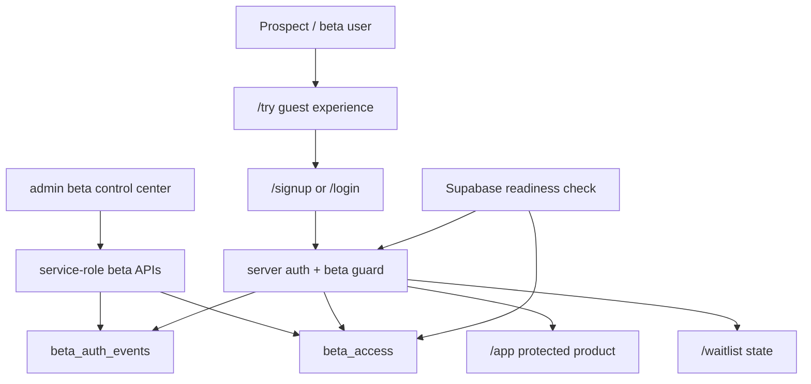
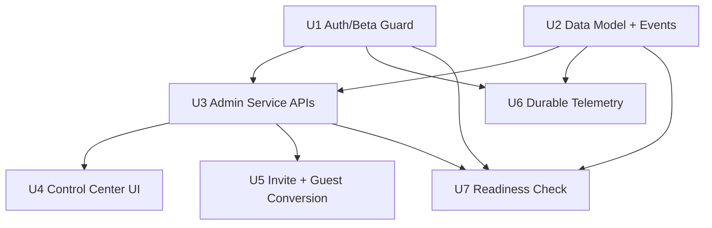
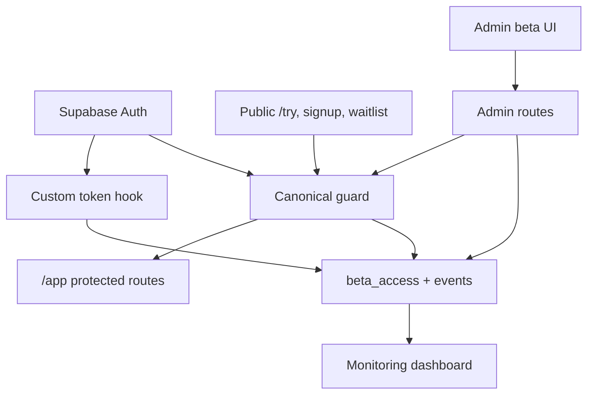

# Beta Access and Sharing Operations

## Summary

This plan turns the auth/beta ideation into an implementation path for operating a gated beta: align the server beta guard with current Supabase SSR guidance, add a service-role-backed admin surface for approving and revoking beta users, and make approval produce a shareable beta invite path that can start at `/try` and end in an approved account.

---

## Problem Frame

ThinkHaven already has Supabase Auth, a `beta_access` table, a custom token hook, and a `/try` guest funnel, but beta operations still depend on manual database edits and fragile visibility. The current `/app/*` beta gate also checks `getSession()` plus local JWT verification while Supabase's current SSR guidance says server protection should rely on validated claims rather than trusting sessions from cookies.

---

## Assumptions

*This plan was authored without synchronous confirmation after ideation. The items below are unvalidated planning bets that should be reviewed before implementation proceeds.*

- The first shippable beta-sharing workflow should prioritize one-person operator control over automated lifecycle CRM.
- Manual invite-link copy from an admin control center is acceptable for v1; automated email delivery can follow once copy, state, and telemetry are proven.
- `/try` should remain the low-friction prospect path, but authenticated users who are not beta-approved should still land on the waitlist state rather than full `/app/*` access.
- Admin eligibility can initially reuse `lib/auth/admin.ts`; a database-backed admin role model is valuable but not required for the first beta operations surface.

---

## Requirements

- R1. Protect `/app/*` with a single server-only auth/beta guard that uses Supabase-validated user or claim data and keeps the `beta_access` table fallback for stale custom-claim cases.
- R2. Provide an admin-only beta control center where an operator can see pending, approved, revoked, signed-up, and gated users.
- R3. Allow an admin to approve, revoke, and re-approve beta access through service-role-safe server code without exposing service credentials or client-side update policies.
- R4. Make approval produce a clear sharing action: copy a branded invite link and track invite-copy/send state.
- R5. Preserve and strengthen the `/try` guest-to-signup path so beta prospects can experience the product before requesting or receiving access.
- R6. Persist sanitized auth and beta-funnel events durably enough for beta operations, instead of relying only on in-memory/localStorage aggregation.
- R7. Add a readiness check that verifies Supabase environment, hook, RLS, and beta table assumptions before sending beta invites.
- R8. Maintain privacy and security: avoid PII in general logs, enforce admin checks before service-role operations, and keep session-scoped data behind ownership checks.

---

## Scope Boundaries

- This plan does not replace Supabase Auth or introduce another identity provider.
- This plan does not open the beta gate to all signed-in users.
- This plan does not build cohort management, CRM pipelines, enterprise SSO, or team collaboration.
- This plan does not create public read-only session snapshots; that remains a later privacy/IDOR-sensitive feature.
- This plan does not require automated email delivery in the first release. The invite path can start with copyable links and durable tracking.

### Deferred to Follow-Up Work

- Automated Resend-based invite email delivery: add after manual invite copy proves the approval and destination flow.
- Database-backed admin role management: revisit when more than the current owner/operator needs access.
- Shareable Beta Session Snapshot: plan separately with explicit redaction, revocation, and token-access requirements.
- Durable production-grade observability stack: this plan stores beta/auth funnel events in the app database, but does not add Sentry, Logtail, or external warehouse sync.

---

## Context & Research

### Relevant Code and Patterns

- `apps/web/app/app/layout.tsx` is the current protected app gate and calls `checkBetaAccess()`.
- `apps/web/lib/auth/beta-access.ts` currently verifies a session token locally and falls back to `beta_access`; this is the main guard to replace or evolve.
- `apps/web/lib/supabase/server.ts` already uses `@supabase/ssr` and safely returns `null` when build-time env vars are missing.
- `apps/web/middleware.ts` and `apps/web/lib/supabase/middleware.ts` both show the existing cookie-refresh/auth-validation posture.
- `apps/web/supabase/migrations/013_beta_access.sql` through `017_fix_custom_access_token_hook.sql` define the beta table, waitlist uniqueness, signup linking, and custom `beta_approved` claim.
- `apps/web/components/waitlist/WaitlistForm.tsx` inserts public waitlist rows directly into `beta_access`.
- `apps/web/app/try/page.tsx`, `apps/web/app/components/guest/SignupPromptModal.tsx`, and `apps/web/lib/guest/session-migration.ts` are the current guest funnel and migration path.
- `apps/web/lib/monitoring/auth-logger.ts`, `apps/web/lib/monitoring/auth-metrics.ts`, and `apps/web/app/api/monitoring/auth-metrics/route.ts` provide the existing non-durable monitoring shape.
- `docs/plans/2026-02-15-feat-wave1-beta-launch-prep-plan.md` previously recommended direct signup for Wave 1 testers, but this newer plan intentionally uses `/try` as the share-first path for unapproved prospects.

### Institutional Learnings

- `AGENTS.md` warns that server Supabase clients may return `null`; every server caller in this plan needs explicit service-unavailable handling.
- `AGENTS.md` requires IDOR checks on every session-scoped handler and warns that client components cannot import server-only modules.
- `docs/solutions/security-issues/multi-agent-review-security-correctness-hardening.md` emphasizes no PII in logs, avoiding redundant `getUser()` calls, and type-safe admin/JWT checks.
- `docs/technical-debt/oauth-test-infrastructure-failures.md` distinguishes product auth behavior from unreliable OAuth test harness behavior; the plan should not treat OAuth E2E fragility as proof that production auth is broken.

### External References

- Supabase SSR client docs: server-side protection should use cookie-backed clients and validated claims, and should not trust `getSession()` in server code.
- Supabase Auth Hooks docs: custom hooks require selective grants to `supabase_auth_admin`, explicit RLS access, and short-running hook logic.
- Supabase Custom Access Token Hook docs: returned claims must preserve required token fields and custom claims should be added without breaking token shape.
- Supabase Users docs: anonymous users are separate from unauthenticated public users and are a valid model for demos or temporary flows, supporting the `/try` funnel direction.

---

## Key Technical Decisions

- Centralize beta access decisions in one server-only guard: keeps `/app/*`, admin APIs, and readiness checks from drifting into separate interpretations of "approved."
- Prefer Supabase-validated auth data over local JWT verification for server protection: aligns the app with current Supabase SSR guidance and reduces dependency on `SUPABASE_JWT_SECRET` for request-time gatekeeping.
- Keep the `beta_access` table fallback after claim checks: approvals may be newer than a user's current token, and the fallback prevents stale custom claims from blocking newly approved users.
- Use a lazy service-role client only inside server-only admin modules: avoids build-time env crashes and prevents service-role access from leaking into client bundles.
- Store beta-funnel events as sanitized operational telemetry: admin users need visibility into gates, approvals, invites, and first access, but general logs should not expose raw email or session content.
- Start invite sharing with copyable branded links: this satisfies beta sharing without prematurely committing to email provider configuration, retry semantics, unsubscribe handling, or template policy.

---

## Open Questions

### Resolved During Planning

- Should v1 use direct signup or `/try` for beta sharing? Use `/try` for prospects and a direct `/signup` or `/login` destination for already-approved invitees when the operator knows the person is ready to create an account.
- Should admin writes happen through RLS policies from the browser? No. Keep `beta_access` update/revoke operations behind service-role server code with an admin guard.
- Should email automation be in v1? No. Track invite-copy/send state, but defer provider-backed sends until the manual workflow is useful.

### Deferred to Implementation

- Exact invite URL parameters and copy text: finalize when the destination routing is implemented and tested.
- Exact telemetry retention window: choose an initial bounded retention policy while implementing the event table and dashboard filters.
- Whether Supabase `auth.getClaims()` is available in the installed `@supabase/supabase-js` surface in this repo: implementation should verify the package API and fall back to validated `getUser()` if needed, while keeping the plan's security posture intact.

---

## High-Level Technical Design

> *This illustrates the intended approach and is directional guidance for review, not implementation specification. The implementing agent should treat it as context, not code to reproduce.*

---

## Implementation Units

- U1. **Align Server Auth and Beta Guard**

**Goal:** Replace the current split between session-token verification and beta table fallback with a single server-only guard that returns typed access outcomes for unauthenticated, pending, approved, admin, and unavailable states.

**Requirements:** R1, R5, R8

**Dependencies:** None

**Files:**
- Modify: `apps/web/lib/auth/beta-access.ts`
- Modify: `apps/web/app/app/layout.tsx`
- Modify: `apps/web/lib/auth/jwt-verify.ts`
- Test: `apps/web/tests/lib/auth/beta-access.test.ts`
- Test: `apps/web/tests/e2e/smoke/auth-session.spec.ts`

**Approach:**
- Evolve `checkBetaAccess()` into the canonical server guard or create a nearby replacement that keeps the same caller simple for `app/app/layout.tsx`.
- Prefer Supabase-validated auth data for the current user and claims; keep local JWT verification only as a compatibility fallback if implementation proves it is still required.
- Preserve admin bypass behavior through `isAdminEmail()` but ensure admin is represented as an explicit access outcome.
- Keep the `beta_access` table fallback for approved records when custom claims are stale or unavailable.
- Return a service-unavailable result when `createClient()` returns `null` so layouts and APIs can distinguish missing infrastructure from unauthenticated users.

**Execution note:** Add characterization tests around the current approved, pending, admin, invalid-token, missing-env, and stale-claim behaviors before changing the guard.

**Patterns to follow:**
- `apps/web/lib/supabase/server.ts` for nullable server-client creation.
- `apps/web/middleware.ts` comments on validated auth calls versus session trust.
- `docs/solutions/security-issues/multi-agent-review-security-correctness-hardening.md` for guarded JWT and admin checks.

**Test scenarios:**
- Happy path: approved beta claim for an authenticated user -> guard returns approved with user identity.
- Happy path: pending claim but `beta_access.approved_at` exists for the user -> guard returns approved through the table fallback.
- Happy path: admin email without beta row -> guard returns approved with admin outcome.
- Edge case: authenticated user has no beta row -> guard returns pending without throwing.
- Edge case: server Supabase client is unavailable because env vars are missing -> guard returns unavailable, not unauthenticated.
- Error path: invalid or missing auth state -> guard returns unauthenticated and the app layout redirects to login.
- Integration: `/app` route with pending user reaches `/waitlist`; approved/admin users do not.

**Verification:**
- `/app/*` uses the canonical guard and no longer depends on ad hoc beta checks.
- Tests prove claim-first, table-fallback, admin, pending, unauthenticated, and unavailable outcomes.

---

- U2. **Add Beta Operations Data Model and Event Log**

**Goal:** Extend the database model so beta operations can track revocation, invite state, last gate access, and durable auth/beta funnel events without overloading console logs.

**Requirements:** R2, R3, R4, R6, R8

**Dependencies:** None

**Files:**
- Create: `apps/web/supabase/migrations/030_beta_operations.sql`
- Modify: `apps/web/lib/supabase/client.ts`
- Test: `apps/web/tests/integration/rls-policy-validation.test.ts`
- Test: `apps/web/tests/lib/beta/beta-events.test.ts`

**Approach:**
- Add migration-backed fields or companion tables for beta lifecycle state that cannot be represented by `approved_at` alone, including revocation and invite tracking.
- Add a durable `beta_auth_events`-style table for sanitized operational events such as waitlist join, approval, revocation, invite copied, beta gate pending, beta gate approved, and first app access.
- Keep public waitlist insert behavior intact while ensuring admin update/revoke operations remain unavailable to browser RLS.
- Update generated or local database types if the repo maintains them manually.
- Include grants and RLS policies needed by the Supabase auth hook if the hook reads changed beta state, including `supabase_auth_admin` schema/table access rather than relying on service-role behavior by assumption.
- Treat revocation as current-access state, not merely historical audit metadata, so the custom access-token hook and server guard can agree on revoked users.

**Patterns to follow:**
- `apps/web/supabase/migrations/013_beta_access.sql` for table comments, indexes, and RLS policy style.
- `apps/web/supabase/migrations/016_fix_beta_access_trigger_v2.sql` for defensive auth-trigger behavior.
- `apps/web/supabase/migrations/017_fix_custom_access_token_hook.sql` for custom-claim hook maintenance.

**Test scenarios:**
- Happy path: pending waitlist row can still be inserted by the public waitlist flow.
- Happy path: approved user row exposes enough state for the custom access-token hook to set `beta_approved`.
- Happy path: `supabase_auth_admin` can read the beta state required by the custom access-token hook under RLS.
- Edge case: revoked user with a historical `approved_at` is treated as not currently approved.
- Error path: authenticated non-admin cannot update or delete another user's beta record through anon/authenticated policies.
- Integration: event rows can be inserted by server-side operations without granting public write access to privileged lifecycle fields.

**Verification:**
- Migration sequence remains contiguous after the current latest migration, `029_feedback_type_toggle.sql`.
- RLS validates public waitlist insert, user self-read, no browser update/delete, and service-role/admin server write expectations.

---

- U3. **Build Admin Service Boundary and Beta APIs**

**Goal:** Add server-only beta operations APIs that list users, approve/revoke access, produce invite links, and write audit events through a guarded service-role boundary.

**Requirements:** R2, R3, R4, R6, R8

**Dependencies:** U1, U2

**Files:**
- Create: `apps/web/lib/supabase/admin.ts`
- Create: `apps/web/lib/beta/beta-admin.ts`
- Create: `apps/web/app/api/admin/beta-access/route.ts`
- Create: `apps/web/app/api/admin/beta-access/[id]/route.ts`
- Create: `apps/web/app/api/admin/beta-access/[id]/invite/route.ts`
- Test: `apps/web/tests/api/admin/beta-access.test.ts`

**Approach:**
- Create a lazy service-role Supabase client that is only imported by server route handlers and server-only beta modules.
- Mark the service-role helper as server-only so accidental client imports fail early.
- Gate every admin API call with the canonical auth/admin check before constructing or using service-role operations.
- List beta records with derived status fields useful to the operator: pending, approved, revoked, signed up, invited, and last gate activity.
- Implement approve, revoke, and invite-link generation as server operations that write beta events.
- Ensure API responses do not expose unnecessary user metadata, raw session data, or service-level errors.

**Execution note:** Implement admin API tests first; service-role mistakes are high-impact and hard to see through UI-only testing.

**Patterns to follow:**
- `apps/web/app/api/monitoring/auth-metrics/route.ts` for admin-only endpoint shape, while improving on its repeated client construction through shared guard helpers.
- `apps/web/lib/security/rate-limiter.ts` response helper if mutation endpoints need rate limiting.
- `AGENTS.md` pitfall: admin bypass checks must happen before rate limiting when admin access is intentional.

**Test scenarios:**
- Happy path: admin can list beta records with derived status and no service-role leakage.
- Happy path: admin approval sets current access state, audit actor, and an approval event.
- Happy path: admin revocation removes current access while preserving historical audit fields.
- Happy path: admin invite action returns a branded destination and records invite-copy/send state.
- Edge case: approving an email-only waitlist row does not require the user to have signed up yet.
- Error path: non-admin authenticated user receives forbidden behavior for every list/mutate route.
- Error path: unauthenticated caller receives authentication-required behavior for every route.
- Error path: missing service-role env returns service-unavailable behavior without attempting partial writes.
- Integration: approve followed by U1 guard table fallback allows access for a user whose token has not refreshed yet.

**Verification:**
- No client component can import the service-role helper.
- Every admin route has explicit unauthenticated, non-admin, missing-env, success, and write-failure coverage.

---

- U4. **Create Beta Access Control Center UI**

**Goal:** Provide a compact admin-only UI for operating the beta: search/filter beta users, approve/revoke rows, copy invite links, and inspect access status.

**Requirements:** R2, R3, R4, R6

**Dependencies:** U3

**Files:**
- Create: `apps/web/app/admin/beta/page.tsx`
- Create: `apps/web/app/components/admin/BetaAccessControlCenter.tsx`
- Create: `apps/web/app/components/admin/BetaAccessStatusBadge.tsx`
- Modify: `apps/web/app/monitoring/page.tsx`
- Test: `apps/web/tests/components/admin/BetaAccessControlCenter.test.tsx`
- Test: `apps/web/tests/e2e/smoke/beta-admin.spec.ts`

**Approach:**
- Add a server-protected admin page that reuses the canonical guard and only renders for admin users.
- Keep the UI operational and dense: table/list, filters, status badges, row actions, and clear loading/error/empty states.
- Use the existing design system colors and typography from `globals.css`; avoid card-heavy marketing layout.
- Call admin API routes from a client component for row actions, with optimistic UI only when rollback behavior is clear.
- Keep row actions keyboard-accessible and expose loading, success, and failure states without relying only on color.
- Link from the existing monitoring page for admin users so beta ops and auth monitoring are discoverable together.

**Patterns to follow:**
- `apps/web/app/components/monitoring/AuthMetricsDashboard.tsx` for dashboard data-refresh structure.
- `apps/web/app/error.tsx` and `apps/web/app/not-found.tsx` for branded error-state tone.
- `AGENTS.md` design-system guidance: use `text-muted-foreground` or `text-ink-light`, not `text-secondary`.

**Test scenarios:**
- Happy path: admin sees beta rows grouped or filtered by pending, approved, revoked, and signed-up states.
- Happy path: approving a pending row updates row state and exposes/copies an invite action.
- Happy path: revoking an approved row updates row state and removes current-access affordances.
- Happy path: keyboard user can focus filters and row actions, trigger approve/revoke/copy, and observe status changes.
- Edge case: empty beta table renders an actionable empty state without breaking layout.
- Edge case: long emails and status labels wrap or truncate without overlapping table actions.
- Error path: API load failure shows retry affordance and does not display stale privileged data as fresh.
- Error path: mutation failure restores the previous row state and explains that the action did not apply.
- Integration: non-admin visiting `/admin/beta` is blocked before any beta data is fetched.

**Verification:**
- Admin can complete pending -> approved -> invite copied and approved -> revoked flows from the UI.
- Browser tests confirm non-admin access is blocked and admin row actions work with mocked or test-backed data.

---

- U5. **Connect Invite Sharing and Guest-to-Beta Conversion**

**Goal:** Make beta sharing coherent for both prospects and approved users by connecting invite destinations, `/try`, signup/login, waitlist state, and guest session migration.

**Requirements:** R4, R5, R6, R8

**Dependencies:** U1, U3

**Files:**
- Modify: `apps/web/app/try/page.tsx`
- Modify: `apps/web/app/components/guest/SignupPromptModal.tsx`
- Modify: `apps/web/app/signup/page.tsx`
- Modify: `apps/web/app/login/page.tsx`
- Modify: `apps/web/app/waitlist/page.tsx`
- Modify: `apps/web/lib/guest/session-migration.ts`
- Create: `apps/web/lib/beta/invite-destinations.ts`
- Test: `apps/web/tests/lib/beta/invite-destinations.test.ts`
- Test: `apps/web/tests/components/guest/SignupPromptModal.test.tsx`
- Test: `apps/web/tests/e2e/smoke/beta-invite-conversion.spec.ts`

**Approach:**
- Define a small invite-destination helper so copied invite links route prospects intentionally instead of scattering URL logic across UI and API code.
- Use `/try` as the share-first path for unapproved prospects while preserving existing signup and login flows for approved users.
- Ensure guest migration does not imply beta approval; after signup, pending users should keep their migrated data but still see the waitlist state until approved.
- Add waitlist copy that recognizes the user is signed in but not approved, without promising automatic access.
- Record durable beta events for invite arrival, signup from invite, guest migration attempt, pending gate, and approved first access.

**Patterns to follow:**
- `apps/web/app/try/page.tsx` for current authenticated-user migration behavior.
- `apps/web/lib/guest/session-migration.ts` for guest data sanitization and message limits.
- `apps/web/app/waitlist/page.tsx` for the existing pending access surface.

**Test scenarios:**
- Happy path: unapproved prospect opens invite link, tries guest flow, signs up, migrates guest session, and lands in pending waitlist state.
- Happy path: approved invitee signs in and reaches `/app` after guard approval.
- Happy path: authenticated approved user visiting `/try` with guest data migrates and redirects to `/app`.
- Edge case: authenticated pending user visiting `/try` does not bypass `/waitlist` through migration redirect.
- Edge case: guest session with no messages signs up without creating an empty migrated session.
- Error path: migration insert failure leaves the user authenticated but does not lose the original guest session until success.
- Integration: invite-link events and guard events let an admin distinguish "invited but not signed up" from "signed up but pending."

**Verification:**
- The first-use path can be shared as one link and behaves predictably for prospect, pending signed-in user, and approved signed-in user states.
- Guest-to-beta tests prove migration and beta gate decisions are independent.

---

- U6. **Persist Durable Auth and Beta Telemetry**

**Goal:** Replace beta-relevant monitoring blind spots with durable, sanitized operational events and an admin-readable view of auth/beta funnel health.

**Requirements:** R2, R6, R8

**Dependencies:** U1, U2, U3

**Files:**
- Create: `apps/web/lib/monitoring/beta-event-logger.ts`
- Create: `apps/web/app/api/beta/waitlist/route.ts`
- Modify: `apps/web/components/waitlist/WaitlistForm.tsx`
- Modify: `apps/web/lib/monitoring/auth-logger.ts`
- Modify: `apps/web/lib/monitoring/auth-metrics.ts`
- Modify: `apps/web/app/api/monitoring/auth-metrics/route.ts`
- Modify: `apps/web/app/components/monitoring/AuthMetricsDashboard.tsx`
- Test: `apps/web/tests/lib/monitoring/beta-event-logger.test.ts`
- Test: `apps/web/tests/api/beta/waitlist.test.ts`
- Test: `apps/web/tests/api/monitoring/auth-metrics.test.ts`

**Approach:**
- Add a server-side beta event logger that writes sanitized event rows through the service boundary from U3.
- Move waitlist submission behind a small server route or add a parallel server event route so waitlist joins can be persisted durably instead of depending only on direct browser inserts.
- Validate waitlist submissions server-side and apply existing rate-limit response helpers so the public route does not become a spam amplification point.
- Keep the existing in-memory auth metrics collector for local UI responsiveness, but make the admin route capable of reading durable beta/auth event aggregates when available.
- Hash or scope email/user identifiers so general logs stay PII-light while admin lookup remains possible through explicit beta records.
- Record events at the guard, admin mutation, invite, waitlist, signup, migration, and first-access points.
- Ensure telemetry failures do not block auth or beta access flows; they should be observable but non-fatal.

**Patterns to follow:**
- `apps/web/lib/monitoring/auth-logger.ts` for existing event categories and correlation IDs.
- `docs/monitoring/auth-slis-slos.md` for the metrics the monitoring UI already claims to represent.
- `docs/solutions/security-issues/multi-agent-review-security-correctness-hardening.md` for PII logging constraints.

**Test scenarios:**
- Happy path: waitlist form submission creates or reuses a beta row and records a durable waitlist event.
- Happy path: beta approval writes an audit event with actor, target, and timestamp without raw service errors.
- Happy path: pending beta gate writes a durable event that can be aggregated for the admin dashboard.
- Happy path: monitoring API returns both auth summary and beta-funnel counts for admin callers.
- Edge case: duplicate waitlist email returns the existing friendly success behavior and records a duplicate/revisit event without creating a second row.
- Edge case: telemetry table unavailable or insert fails -> caller flow continues and returns the primary operation result.
- Error path: non-admin monitoring caller cannot read beta event aggregates.
- Error path: malformed waitlist email is rejected by the server route before database insert.
- Error path: logger rejects unsupported event names or payload shapes before insert.
- Integration: invite copied -> signup from invite -> pending gate -> approval -> first access can be reconstructed from durable events.

**Verification:**
- Admin monitoring can answer who is stuck at invite, signup, pending gate, and first-access stages without relying on browser localStorage.
- No new general-purpose logs include raw emails or session content.

---

- U7. **Add Supabase Readiness Check and Operational Notes**

**Goal:** Provide an admin-only readiness check that verifies beta launch prerequisites before invites are sent and documents how to use it.

**Requirements:** R1, R3, R6, R7, R8

**Dependencies:** U1, U2, U3

**Files:**
- Create: `apps/web/app/api/admin/supabase-readiness/route.ts`
- Create: `apps/web/lib/beta/supabase-readiness.ts`
- Modify: `apps/web/app/admin/beta/page.tsx`
- Create: `docs/ops/beta-access-operations.md`
- Test: `apps/web/tests/api/admin/supabase-readiness.test.ts`
- Test: `apps/web/tests/lib/beta/supabase-readiness.test.ts`

**Approach:**
- Check required runtime env vars lazily and distinguish public client, server client, service-role, custom hook, and telemetry prerequisites.
- Verify the app can read expected beta table shape, perform an admin-scoped sample query, and detect custom-claim readiness without exposing secrets.
- Surface readiness as pass/warn/fail in the admin control center and in an admin API response suitable for smoke testing.
- Document the operator workflow: run readiness, approve a user, copy invite, watch telemetry, and revoke if needed.
- Keep readiness checks read-only except for any explicitly marked synthetic test that implementation chooses to add.

**Patterns to follow:**
- `apps/web/lib/supabase/server.ts` for build-safe env handling.
- `apps/web/app/api/monitoring/alerts/route.ts` and `apps/web/app/api/monitoring/auth-metrics/route.ts` for admin-only operational endpoints.
- `docs/monitoring/auth-runbooks.md` for operational doc tone.

**Test scenarios:**
- Happy path: all required env vars and beta tables are available -> readiness returns pass categories.
- Happy path: missing service-role key -> readiness reports admin operations unavailable without crashing.
- Edge case: custom token hook unavailable or claim not present -> readiness warns that table fallback will be used.
- Error path: non-admin caller cannot run readiness checks.
- Error path: Supabase query failure returns a categorized failure without exposing credentials or raw connection strings.
- Integration: admin page displays readiness status and blocks or warns before invite-copy actions when launch-critical checks fail.

**Verification:**
- Operator can tell before inviting users whether Supabase auth, beta table access, hook configuration, and admin service operations are ready.
- `docs/ops/beta-access-operations.md` gives enough steps for another implementer/operator to run the beta access workflow.

---

## System-Wide Impact

- **Interaction graph:** Auth callback, `/app/*` layout, `/try`, signup/login, waitlist, admin APIs, monitoring APIs, Supabase auth hook, `beta_access`, and new beta event storage all interact through the guard and service boundary.
- **Error propagation:** Auth/guard failures should route users to login, waitlist, or service-unavailable states; telemetry failures should be non-fatal; service-role failures should fail closed for admin writes.
- **State lifecycle risks:** Approval may precede signup, signup may precede approval, revocation may happen while a user has a stale token, and invite copy may happen multiple times. The guard and event model need to tolerate all four.
- **API surface parity:** Admin UI, admin API routes, monitoring routes, and readiness checks must use the same admin authorization and service-role helper.
- **Integration coverage:** Unit tests alone will not prove the beta funnel; E2E coverage should include invite -> try -> signup -> pending and admin approve -> app access.
- **Unchanged invariants:** Existing public waitlist insert remains available, `/app/*` remains protected, session ownership checks remain required for session-scoped APIs, and guest message migration remains limited and sanitized.

---

## Risks & Dependencies

| Risk | Mitigation |
|------|------------|
| Service-role helper leaks into client bundle | Put it in a server-only module, import it only from route handlers/server modules, and add tests or lint review for client imports. |
| Stale JWT custom claims block newly approved users | Keep `beta_access` table fallback in the canonical guard and test approval-before-token-refresh. |
| Revoked users keep access until token refresh | Model current access state separately from historical approval and make the guard check the database for revoked or uncertain states. |
| Admin control center becomes a CRM | Limit v1 fields and actions to beta operations: list, approve, revoke, invite copy, status, readiness, and telemetry. |
| Telemetry adds PII or blocks auth | Use sanitized payloads and make event writes non-fatal to primary auth/beta flows. |
| Supabase API version mismatch around `getClaims()` | Verify installed API during implementation and preserve the validated-auth posture with `getUser()` fallback if needed. |
| Custom access-token hook cannot read beta state under RLS | Migration and readiness check must verify `supabase_auth_admin` grants and RLS access explicitly. |
| Existing OAuth tests remain unreliable | Separate unit/API guard coverage from OAuth E2E expectations and do not block the plan on known OAuth harness debt. |

---

## Phased Delivery

### Phase 1: Secure Access Foundation

- U1 aligns the server guard.
- U2 adds the beta operations and event data model using the next migration after `029`.
- U3 creates the service-role-safe admin API boundary.

### Phase 2: Operator Workflow

- U4 adds the admin beta control center.
- U5 connects approval, invite copy, `/try`, signup/login, waitlist state, and guest migration.

### Phase 3: Operational Confidence

- U6 persists beta/auth funnel telemetry.
- U7 adds readiness checks and the beta access operations runbook.

---

## Documentation / Operational Notes

- Add `docs/ops/beta-access-operations.md` covering readiness, approval, invite copy, revocation, and telemetry triage.
- Update monitoring docs if durable beta event data replaces or supplements the current in-memory/localStorage auth metrics story.
- Update `.env.example` only if implementation introduces new runtime env vars for readiness, invite origins, or later email delivery.
- Keep rollout narrow: ship guard alignment and admin APIs behind admin-only access before exposing the UI link broadly.

---

## Success Metrics

- Admin can approve and revoke a beta user without opening Supabase Table Editor.
- Admin can copy a working beta invite link immediately after approval.
- Approved users reach `/app`; pending or revoked users do not.
- Operator can see invite, signup, pending gate, approval, and first-access events durably.
- Readiness check catches missing service-role, beta table, or hook configuration before beta users are invited.

---

## Sources & References

- Origin ideation: [docs/ideation/2026-04-28-auth-supabase-beta-sharing-ideation.md](../ideation/2026-04-28-auth-supabase-beta-sharing-ideation.md)
- Related brainstorm: [docs/brainstorms/2026-02-15-beta-launch-readiness-brainstorm.md](../brainstorms/2026-02-15-beta-launch-readiness-brainstorm.md)
- Related plan: [docs/plans/2026-02-15-feat-wave1-beta-launch-prep-plan.md](2026-02-15-feat-wave1-beta-launch-prep-plan.md)
- Current beta guard: `apps/web/lib/auth/beta-access.ts`
- Current app gate: `apps/web/app/app/layout.tsx`
- Current beta migrations: `apps/web/supabase/migrations/013_beta_access.sql`, `apps/web/supabase/migrations/016_fix_beta_access_trigger_v2.sql`, `apps/web/supabase/migrations/017_fix_custom_access_token_hook.sql`
- Current guest migration: `apps/web/lib/guest/session-migration.ts`
- Current auth monitoring: `apps/web/lib/monitoring/auth-logger.ts`, `apps/web/lib/monitoring/auth-metrics.ts`
- Supabase SSR client docs: https://supabase.com/docs/guides/auth/server-side/creating-a-client?queryGroups=framework&framework=nextjs
- Supabase Auth Hooks docs: https://supabase.com/docs/guides/auth/auth-hooks
- Supabase Custom Access Token Hook docs: https://supabase.com/docs/guides/auth/auth-hooks/custom-access-token-hook
- Supabase Users docs: https://supabase.com/docs/guides/auth/users
