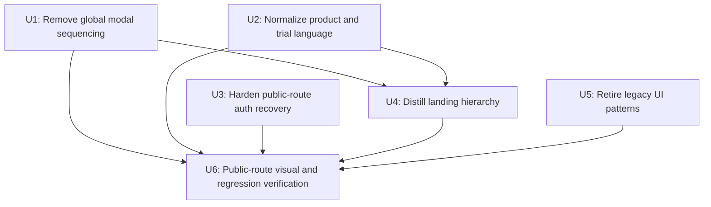

# Site Critique Remediation

## Summary

Remediate the highest-leverage findings from the May 2026 impeccable site critique: remove the global modal-first experience, normalize product and trial language, harden public-route auth behavior, distill the landing hierarchy, and retire legacy UI patterns that conflict with the current design system.

---

## Problem Frame

ThinkHaven's brand and product direction are stronger than the first-run site experience. The product promises quiet, defensible decision architecture, but the public site currently interrupts every route with an explanatory onboarding modal, mixes Alpha and Beta language, contradicts itself on trial limits, and lets public-route errors appear behind global UI.

---

## Assumptions

*This plan was authored from the critique without a separate confirmation step. The items below are agent inferences that should be reviewed before implementation proceeds.*

- The global onboarding modal should be removed from public/auth/error routes rather than merely restyled.
- The public trial offer should standardize on 10 free messages because `/try`, guest copy, and tests already use that number.
- The site should use "Beta" for the current access state unless product leadership explicitly chooses to revert everything to "Alpha."
- Public-route Supabase env resilience should preserve auth protection for protected routes in production while allowing public routes to render cleanly in local/build contexts.
- Landing-page distillation should reduce repeated explanatory blocks without changing the core board-of-advisors positioning.

---

## Requirements

- R1. Remove the modal-as-first-thought experience from landing, login, signup, `/try`, and error states.
- R2. Preserve useful onboarding context as inline or user-invoked explanation, scoped to routes where it helps the user understand the product.
- R3. Normalize launch-state language, product category language, CTA labels, and trial-limit copy across navigation, landing, `/try`, guest chat, tests, and metadata.
- R4. Ensure public routes render cleanly when Supabase public env vars are absent in local, preview, or build contexts.
- R5. Keep protected-route auth and beta gating intact while hardening public-route recovery.
- R6. Distill the landing page toward the product sequence: artifact, decision, confidence.
- R7. Replace legacy UI patterns that conflict with the current design system, including hand-rolled guest modal behavior and heavy accent side-stripes.
- R8. Add focused regression coverage for behavior-bearing changes and keep visual verification explicit for the frontend redesign work.

---

## Scope Boundaries

- No changes to Supabase database schema, RLS policies, beta access migrations, or invite workflows.
- No redesign of the authenticated session workspace beyond removing the global onboarding dependency and cleaning the targeted side-stripe style.
- No new pricing, plan-tier, or billing copy.
- No broad design-system rewrite. `PRODUCT.md`, `DESIGN.md`, `apps/web/app/globals.css`, and `apps/web/tailwind.config.cjs` remain the design-system source of truth.
- No reintroduction of a full-screen tour or multi-step onboarding flow.

### Deferred to Follow-Up Work

- Full mobile responsive audit with `$impeccable adapt` after this remediation ships.
- Visual regression infrastructure for critical public routes.
- Broader Radix migration for other existing hand-rolled modals not touched by the critique.
- Supabase publishable-key migration if the project chooses to move from legacy anon keys to current Supabase key naming.

---

## Context & Research

### Relevant Code and Patterns

- `PRODUCT.md` defines ThinkHaven as a decision architecture platform and requires artifact, decision, confidence sequencing.
- `DESIGN.md` rejects identical card grids, side-stripe borders, modal-as-first-thought patterns, generic B2B SaaS, and AI-bro visual language.
- `apps/web/app/providers.tsx` mounts `OnboardingModal` globally next to `FeedbackModal`, which makes the onboarding modal appear on unrelated public and auth routes.
- `apps/web/app/components/onboarding/OnboardingModal.tsx` contains the modal copy, localStorage completion flag, and Radix dialog implementation.
- `apps/web/app/page.tsx` contains the landing hero, repeated CTAs, board card grid, inconsistent "5 messages" copy, and final CTA.
- `apps/web/app/components/ui/navigation.tsx` defines the reusable `AlphaBadge` and repeated "Try Free" labels.
- `apps/web/app/try/page.tsx`, `apps/web/app/try/layout.tsx`, and `apps/web/app/components/guest/GuestChatInterface.tsx` already describe the guest experience as 10 free messages.
- `apps/web/app/components/guest/SignupPromptModal.tsx` is a hand-rolled modal and should follow the project's Radix-dialog requirement when touched.
- `apps/web/middleware.ts` directly creates the Supabase SSR client with non-null env assertions, while `apps/web/lib/supabase/middleware.ts` already has a safer env-guarded pattern.
- `apps/web/app/error.tsx` provides a branded error surface but can be obscured by the global onboarding modal.
- `apps/web/tests/components/landing-page.test.tsx`, `apps/web/tests/components/ui/navigation.test.tsx`, `apps/web/tests/components/auth/login.test.tsx`, and e2e smoke tests are the nearest existing coverage for public surfaces.

### Institutional Learnings

- `docs/solutions/design-system-refactoring/wes-anderson-palette-retheme-comprehensive.md` documents why design tokens and modal patterns need systematic enforcement rather than ad hoc visual fixes.
- `docs/solutions/code-quality/landing-page-review-findings-and-fixes.md` documents landing-page drift risks, CTA duplication, and navigation component extraction patterns.
- `docs/solutions/patterns/individual/pattern-02-single-source-of-truth-for-ui-components.md` supports reusing canonical primitives and Radix patterns instead of keeping parallel modal implementations.
- AGENTS.md pitfall #19 says the actual design system lives in `globals.css` and `tailwind.config.cjs`, not regenerated design docs.
- AGENTS.md pitfall #27 requires Radix Dialog for all new modals.

### External References

- Supabase Next.js SSR docs recommend `@supabase/ssr` cookie-based clients and proxy/middleware session refresh for server-side auth.
- Supabase's current Next.js guidance names the newer publishable-key pattern while still noting legacy anon keys may exist during transition.

---

## Key Technical Decisions

- Remove global onboarding from the provider and replace it with route-scoped, non-blocking education. This directly resolves the critique's modal-first sequencing issue.
- Treat `/try` as the primary onboarding surface. Landing should earn the click; `/try` should carry the light contextual framing needed to begin.
- Standardize on "Beta" and "decision architecture platform" unless product leadership intentionally changes the market state.
- Standardize public CTA language around "Try a Free Session" for primary route-to-trial actions, with shorter labels only where space requires them.
- Reuse the existing env-guarded Supabase middleware utility rather than inventing a second public-route bypass.
- Collapse landing explanation into fewer, stronger sections rather than adding another explanatory component.
- Migrate `SignupPromptModal` to Radix because it is in active scope and currently conflicts with the project modal rule.

---

## Open Questions

### Resolved During Planning

- Which trial limit should be canonical? Use 10 free messages because `/try`, guest chat, helper selectors, route docs, and signup prompt already use 10. The landing page is the outlier.
- Should onboarding remain a modal? No for first-run public routes. Modal content may become inline copy or a user-invoked explainer only where context is needed.
- Should middleware fail open globally when Supabase env vars are missing? No. Public routes should render cleanly in local/build contexts; protected-route auth behavior should remain explicit and verified.

### Deferred to Implementation

- Exact final landing section count after distillation. The implementer should preserve the core hero and board metaphor while reducing repeated explanatory patterns.
- Whether the removed onboarding modal component is deleted or retained as an explicit help dialog. Prefer deletion unless an existing affordance still imports it.
- Exact copy for the inline `/try` context. It should be short, product-voice aligned, and avoid reintroducing a tour.
- Whether middleware should call the existing `updateSession` utility directly or absorb its env guard into `apps/web/middleware.ts`. The chosen path should minimize duplicate auth logic.

---

## High-Level Technical Design

> *This illustrates the intended approach and is directional guidance for review, not implementation specification. The implementing agent should treat it as context, not code to reproduce.*

---

## Implementation Units

### U1. Remove Global Onboarding Modal Sequencing

**Goal:** Stop the onboarding modal from appearing globally across landing, auth, trial, and error routes while preserving any useful product education as non-blocking route-scoped context.

**Requirements:** R1, R2, R8

**Dependencies:** None

**Files:**
- Modify: `apps/web/app/providers.tsx`
- Modify: `apps/web/app/components/onboarding/OnboardingModal.tsx`
- Modify: `apps/web/app/components/workspace/SessionHeader.tsx`
- Test: `apps/web/tests/components/onboarding-modal.test.tsx`
- Test: `apps/web/tests/components/auth/login.test.tsx`

**Approach:**
- Remove the unconditional `<OnboardingModal />` render from the global provider.
- Remove `resetOnboarding` from session header actions if no longer needed, or replace it with a route-local help affordance that does not auto-open.
- Keep the Radix implementation only if an explicit user-invoked help dialog remains. Otherwise delete the component and its localStorage key.
- Ensure login, signup, landing, `/try`, and branded error states have no automatic onboarding overlay.

**Patterns to follow:**
- `apps/web/app/components/feedback/FeedbackModal.tsx` for globally mounted UI that only opens from explicit store state.
- `apps/web/app/components/board/BoardExplainerSheet.tsx` for user-invoked explanatory UI.
- PRODUCT.md's "artifact over conversation" and "quiet confidence" principles.

**Test scenarios:**
- Integration. Rendering the provider around `/login` content does not mount a visible onboarding dialog when localStorage lacks the completion flag.
- Integration. Rendering the provider around landing content does not show "ThinkHaven is a decision design system."
- Happy path. If the component remains as explicit help UI, opening and closing it requires a user action and persists dismissal only for that help affordance.
- Edge case. Clearing `thinkhaven_onboarding_completed` does not cause auth or error routes to show a blocking modal.

**Verification:**
- No unconditional `<OnboardingModal />` exists in `apps/web/app/providers.tsx`.
- Login, signup, `/try`, and branded error screenshots show their primary task without an overlay.
- Tests prove localStorage state does not control route-global blocking UI.

---

### U2. Normalize Product Language and Trial Promise

**Goal:** Align visible public copy with PRODUCT.md and remove inconsistencies around Alpha/Beta state, category language, CTA wording, and message limits.

**Requirements:** R3, R8

**Dependencies:** None

**Files:**
- Modify: `apps/web/app/page.tsx`
- Modify: `apps/web/app/components/ui/navigation.tsx`
- Modify: `apps/web/app/try/page.tsx`
- Modify: `apps/web/app/try/layout.tsx`
- Modify: `apps/web/app/components/guest/GuestChatInterface.tsx`
- Modify: `apps/web/app/components/guest/SignupPromptModal.tsx`
- Modify: `apps/web/tests/components/landing-page.test.tsx`
- Modify: `apps/web/tests/components/ui/navigation.test.tsx`
- Modify: `apps/web/tests/helpers/selectors.ts`
- Modify: `apps/web/tests/helpers/routes.ts`

**Approach:**
- Replace `AlphaBadge` with a single launch-state badge whose text matches the hero state.
- Standardize on "Beta" across nav and hero unless the product owner explicitly changes the state globally.
- Replace "decision design system" copy with "decision architecture platform" where category language is needed.
- Standardize public primary CTAs to "Try a Free Session" on full-width surfaces and use shorter "Try Free" only for compact navigation if necessary.
- Change landing trial copy from 5 messages to 10 free messages.
- Ensure tests assert the new canonical labels instead of preserving stale wording.

**Patterns to follow:**
- PRODUCT.md Product Purpose section for product category language.
- Existing route helper comments in `apps/web/tests/helpers/routes.ts` for the 10-message trial.
- Existing navigation badge extraction pattern in `apps/web/app/components/ui/navigation.tsx`.

**Test scenarios:**
- Happy path. Landing renders "Beta" and not "Alpha."
- Happy path. Landing, `/try`, guest welcome, and signup prompt all reference 10 free messages.
- Edge case. Navigation renders one launch-state badge implementation in both loading and loaded states.
- Regression. Existing navigation click tests still route trial CTAs to `/try`.
- Regression. Landing tests no longer expect stale assessment links or stale outcome headings if those sections are changed by U4.

**Verification:**
- `rg "Alpha|5 messages|decision design system" apps/web/app apps/web/components apps/web/tests` returns no stale public-copy matches, except intentionally documented historical references if any.
- Public CTAs route to `/try`.
- Tests pass after copy updates.

---

### U3. Harden Public-Route Auth and Error Recovery

**Goal:** Ensure public routes and branded error states render cleanly when Supabase public env vars are absent, without weakening protected-route auth behavior.

**Requirements:** R4, R5, R8

**Dependencies:** U1 recommended first, so error states are not masked by global onboarding.

**Files:**
- Modify: `apps/web/middleware.ts`
- Modify: `apps/web/lib/supabase/middleware.ts`
- Modify: `apps/web/tests/e2e/smoke/health.spec.ts`
- Modify: `apps/web/tests/integration/auth-redirect-flow.test.tsx`
- Test: `apps/web/tests/integration/middleware-public-routes.test.ts`

**Approach:**
- Prefer delegating root middleware to the existing env-guarded `updateSession` utility, or port its env guard into the root middleware if direct delegation creates runtime constraints.
- Public routes should pass through when Supabase public env vars are missing.
- Protected routes should continue redirecting unauthenticated users to `/login` when auth can be evaluated.
- Keep `/auth/callback` behavior compatible with OAuth.
- Preserve redirect search params for protected deep links.
- Add coverage that exercises missing-env behavior for `/`, `/try`, `/login`, and `/signup` without relying on a real Supabase connection.

**Patterns to follow:**
- `apps/web/lib/supabase/middleware.ts` env guard and redirect behavior.
- `apps/web/lib/supabase/server.ts` null-return pattern for missing env during build.
- Supabase Next.js SSR docs for cookie-based server auth and avoiding `getSession()` as an authorization source.

**Test scenarios:**
- Happy path. With Supabase env present and no user, protected `/app` redirects to `/login?redirect=/app`.
- Happy path. With Supabase env absent, public `/`, `/try`, `/login`, and `/signup` return `NextResponse.next` instead of throwing.
- Edge case. `/auth/callback` bypasses middleware interference.
- Error path. With Supabase env absent, protected `/app` does not crash. The expected behavior should be explicit in the test based on the chosen implementation path.
- Regression. Authenticated users hitting `/login?redirect=/admin/beta` still preserve redirect intent through existing auth flow expectations.

**Verification:**
- Local dev can render public routes with no real Supabase project values.
- Protected-route behavior is covered by integration tests.
- No root middleware non-null assertions remain for Supabase public env values.

---

### U4. Distill Landing Hierarchy Around Artifact, Decision, Confidence

**Goal:** Reduce repeated explanatory sections and CTA duplication so the landing page demonstrates the product sequence rather than explaining it through generic card grids.

**Requirements:** R2, R6, R8

**Dependencies:** U1, U2

**Files:**
- Modify: `apps/web/app/page.tsx`
- Modify: `apps/web/tests/components/landing-page.test.tsx`

**Approach:**
- Keep the strong hero promise and chat-preview proof point.
- Remove the modal's explanatory burden by folding only the necessary context into the landing page itself.
- Merge or shorten "How It Works," board cards, and "What You Walk Away With" so the page follows artifact, decision, confidence.
- Reduce repeated primary CTA blocks. Keep a clear hero CTA and one final CTA.
- Preserve the board-of-directors metaphor, but avoid six identical decorative cards if a more editorial excerpt or compact advisor row carries the idea with less visual repetition.
- Keep the Kevin Holland credibility section only if it supports executive trust without crowding the product story.

**Patterns to follow:**
- PRODUCT.md sequence: artifact, decision, confidence.
- DESIGN.md rejection of identical icon-card grids and generic B2B SaaS layouts.
- `docs/solutions/code-quality/landing-page-review-findings-and-fixes.md` for existing landing drift and CTA duplication risks.

**Test scenarios:**
- Happy path. Landing still renders the H1, board-of-advisors positioning, primary `/try` CTA, and waitlist form.
- Regression. Landing does not render the removed modal title or obsolete 5-message text.
- Edge case. All CTA links still have valid anchors and retain `/try` routing.
- Visual expectation. Desktop landing screenshot shows no blocking overlay and does not stack multiple repeated CTA sections above the fold.
- Visual expectation. Mobile landing screenshot shows no text overlap, hero content fits, and the next section is visible enough to orient scroll.

**Verification:**
- Landing page content follows a clear artifact, decision, confidence progression.
- `apps/web/tests/components/landing-page.test.tsx` reflects the current content rather than stale headings.
- Playwright screenshots for desktop and mobile public landing pass manual visual review.

---

### U5. Retire Targeted Legacy UI Patterns

**Goal:** Replace the hand-rolled guest signup modal with Radix Dialog and remove heavy board side-stripe styling that conflicts with the current design system.

**Requirements:** R7, R8

**Dependencies:** U1 recommended first, so modal behavior is no longer globally entangled.

**Files:**
- Modify: `apps/web/app/components/guest/SignupPromptModal.tsx`
- Modify: `apps/web/app/components/guest/GuestChatInterface.tsx`
- Modify: `apps/web/app/components/board/SpeakerMessage.tsx`
- Modify: `apps/web/app/globals.css`
- Test: `apps/web/tests/components/guest/SignupPromptModal.test.tsx`
- Test: `apps/web/tests/components/board/SpeakerMessage.test.tsx`

**Approach:**
- Convert `SignupPromptModal` to Radix Dialog with overlay, title, description, close behavior, focus trap, and Escape handling.
- Keep the current guest conversion behavior: sign up routes to `/signup?from=guest`, summary view remains available, existing conversation migration assumptions remain untouched.
- Replace inline SVG icons with lucide icons where equivalents exist.
- Remove `.board-speaker-message`'s 3px left border. Use spacing, avatar identity, or a 1px neutral divider if separation is still needed.
- Ensure no new nested-card pattern is introduced while restyling modal content.

**Patterns to follow:**
- `apps/web/app/components/feedback/FeedbackModal.tsx` for Radix dialog structure.
- `apps/web/app/components/board/BoardExplainerSheet.tsx` for explanatory dialog tone and max-height handling.
- DESIGN.md card and modal rules.
- AGENTS.md pitfall #27 requiring Radix Dialog for new modals.

**Test scenarios:**
- Happy path. Guest limit opens the signup dialog; focus lands inside the dialog and the title is announced.
- Happy path. Clicking "Sign up to continue" routes to `/signup?from=guest`.
- Happy path. "View conversation summary" switches to summary mode without closing the dialog.
- Edge case. Escape and close button dismiss the dialog without changing guest session state.
- Accessibility. Dialog has accessible title and description, and background content is not keyboard reachable while open.
- Regression. Board speaker messages render without a 3px side border and still show speaker identity.

**Verification:**
- `SignupPromptModal` imports `@radix-ui/react-dialog`.
- `rg "border-left: 3px|border-l-\\[3px\\]|board-speaker-message" apps/web/app apps/web/components` shows no heavy accent side-stripe violation unless a class name remains without the banned style.
- Guest conversion flow still works manually through the message-limit prompt.

---

### U6. Public-Route Visual and Regression Verification

**Goal:** Prove the critique remediation holds across the public site surfaces affected by the plan.

**Requirements:** R8

**Dependencies:** U1, U2, U3, U4, U5

**Files:**
- Modify: `apps/web/tests/e2e/smoke/health.spec.ts`
- Modify: `apps/web/tests/e2e/smoke/sprint-verification.spec.ts`
- Modify: `apps/web/tests/components/landing-page.test.tsx`
- Modify: `apps/web/tests/components/ui/navigation.test.tsx`

**Approach:**
- Extend public-route smoke checks to assert no onboarding modal appears on `/`, `/try`, `/login`, or `/signup`.
- Add smoke assertions for canonical trial limit and Beta state where practical.
- Capture manual screenshots for desktop and mobile landing, `/try`, login, signup, and a branded error state.
- Run the frontend design verification posture from `ce-frontend-design` or `impeccable` during execution because this plan changes visible UI surfaces without Figma.
- Avoid adding broad visual-regression infrastructure in this unit. The verification is targeted to this remediation.

**Patterns to follow:**
- Existing Playwright smoke structure in `apps/web/tests/e2e/smoke/health.spec.ts`.
- Existing helper selectors in `apps/web/tests/helpers/selectors.ts`.
- The prior manual Playwright screenshot approach from the critique.

**Test scenarios:**
- Integration. Public smoke routes load without modal text or Next.js error overlay.
- Integration. `/try` displays the 10-message guest trial promise.
- Integration. Login and signup forms are immediately usable without any global overlay.
- Visual expectation. Desktop and mobile screenshots show no overlapping UI, no modal-first state, and no obvious one-note card grid repetition above the fold.
- Error path. A branded error state remains readable and actionable without onboarding overlay interference.

**Verification:**
- Relevant unit and smoke tests pass.
- Manual screenshots are captured and inspected for the affected routes.
- No dev server remains running after verification.

---

## System-Wide Impact

- **Interaction graph:** Global providers, public navigation, landing, guest chat, auth pages, root middleware, branded error boundary, and public smoke tests are affected.
- **Error propagation:** Missing Supabase public env should not throw before public pages render. Protected-route failures should continue through redirect or branded error behavior.
- **State lifecycle risks:** Removing onboarding localStorage dependence may leave stale `thinkhaven_onboarding_completed` keys in users' browsers. This is harmless if the component no longer reads it globally.
- **API surface parity:** No API route contract changes are planned. Guest conversion routes and auth callback routes must remain compatible.
- **Integration coverage:** Middleware behavior and global provider rendering need integration coverage because unit-only tests would miss cross-route overlay behavior.
- **Unchanged invariants:** Supabase auth remains the source of truth for protected routes; beta gating and RLS behavior are unchanged; `/try` remains the unauthenticated trial path.

---

## Risks & Dependencies

| Risk | Mitigation |
|------|------------|
| Removing the modal deletes useful first-run education | Move only necessary context into landing or `/try`, and keep user-invoked help if needed |
| Middleware hardening accidentally weakens protected-route access | Cover protected redirect behavior and missing-env public behavior separately |
| Copy updates break brittle tests | Update tests to assert canonical product language rather than stale wording |
| Landing distillation becomes a redesign beyond critique scope | Preserve hero, board metaphor, trial CTA, and waitlist; reduce only repeated explanation and CTA duplication |
| Guest modal Radix migration changes conversion flow | Test routing, summary toggle, close behavior, and guest session persistence |
| Visual regressions are missed without a visual regression suite | Capture manual Playwright screenshots for the affected public routes and mobile landing |

---

## Documentation / Operational Notes

- Update any public-route screenshots or launch checklist references if they mention Alpha, 5 messages, or the removed onboarding modal.
- If middleware changes alter local-dev env expectations, update `.env.example` or developer notes in a follow-up only if the implementation reveals a real gap.
- Leave `PRODUCT.md` and `DESIGN.md` unchanged unless implementation finds they contradict the chosen public language.

---

## Sources & References

- Critique source: May 2026 impeccable site critique in the current Codex session.
- Product register: `PRODUCT.md`
- Design system: `DESIGN.md`
- Global provider: `apps/web/app/providers.tsx`
- Onboarding modal: `apps/web/app/components/onboarding/OnboardingModal.tsx`
- Landing page: `apps/web/app/page.tsx`
- Navigation: `apps/web/app/components/ui/navigation.tsx`
- Guest trial route: `apps/web/app/try/page.tsx`
- Guest chat: `apps/web/app/components/guest/GuestChatInterface.tsx`
- Guest signup modal: `apps/web/app/components/guest/SignupPromptModal.tsx`
- Root middleware: `apps/web/middleware.ts`
- Safer middleware pattern: `apps/web/lib/supabase/middleware.ts`
- Branded error page: `apps/web/app/error.tsx`
- Supabase Next.js SSR docs: `https://supabase.com/docs/guides/auth/server-side/nextjs`
