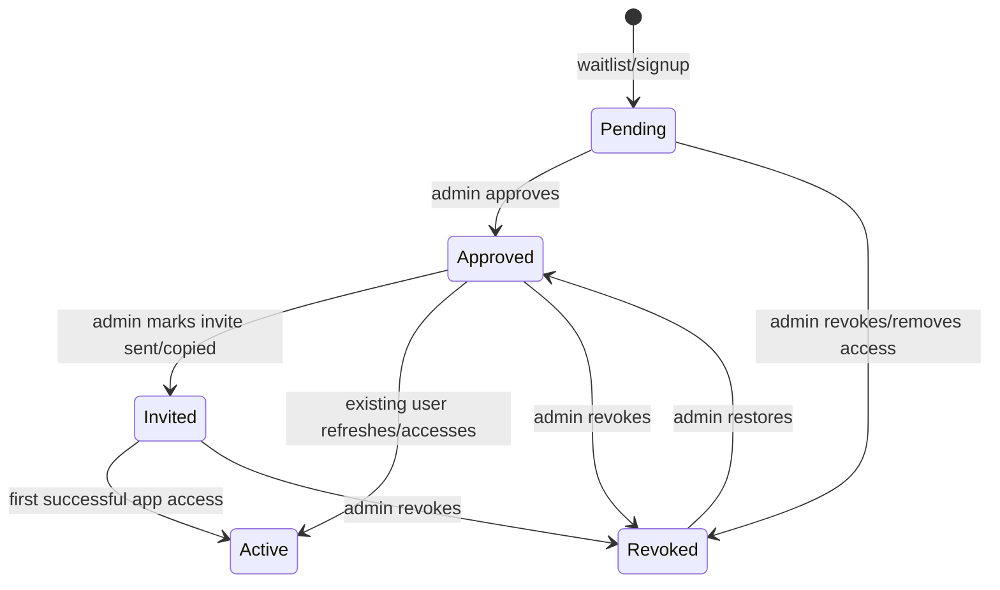
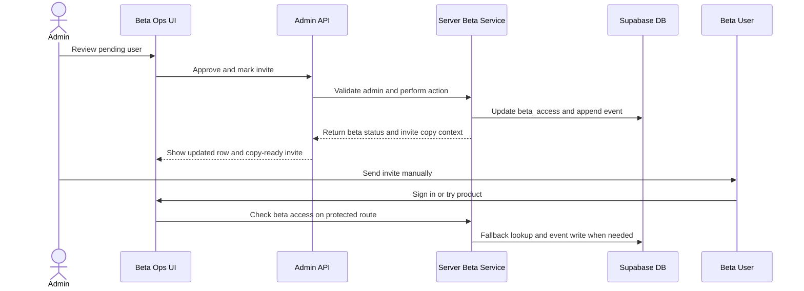
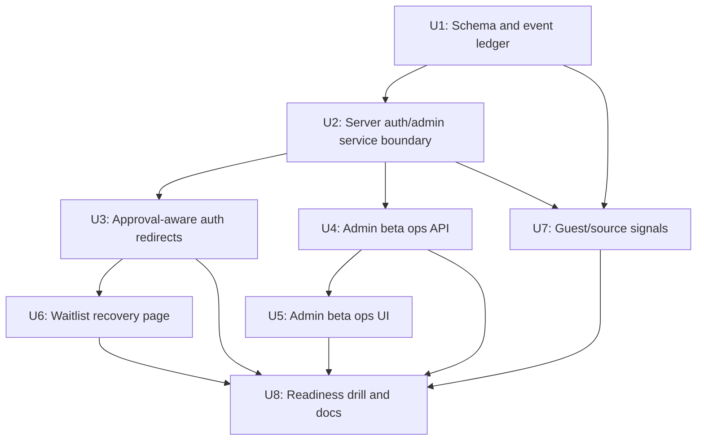

# Beta Access Operations

## Summary

Build the beta operations layer that turns ThinkHaven's existing `beta_access` table into a working gated-beta workflow: admins can inspect pending users, approve and invite them, route users through the right auth/waitlist state, and debug beta-entry failures without editing rows by hand.

---

## Problem Frame

ThinkHaven already has the core beta gate, but operating it still depends on Supabase Table Editor, static waitlist copy, split redirect behavior, and non-durable auth metrics. The next beta-sharing step needs an operator-safe workflow: see who is waiting, approve them, create the invitation moment, understand whether they reached the app, and recover stuck users.

---

## Assumptions

*This plan was authored from the refreshed ideation artifact without a separate confirmation step. The items below are agent inferences that should be reviewed before implementation proceeds.*

- The first version should support manual invite sending/copying rather than fully automated email delivery.
- `beta_access` remains the source of truth for access state; the new event ledger records history and support context but does not replace the access row.
- Admin access should continue using the existing `isAdminEmail` allowlist pattern for this beta-ops surface.
- The admin surface belongs under the authenticated app, likely `/app/admin/beta`, not as a public route.
- The invite path should not use an access-bearing token in v1; access remains tied to approved email/user records until a dedicated invite-token model is intentionally designed.
- `/try` should become a first-class share path and source signal, but Supabase anonymous users are deferred.

---

## Requirements

- R1. Provide an admin-only beta operations surface for pending, approved, invited, active, revoked, and stuck-at-gate users.
- R2. Support atomic approval, revocation, and invite-marking actions with durable audit context.
- R3. Align beta auth and redirect behavior across `/app`, OAuth callback, signup/login redirects, `/try`, and `/waitlist`.
- R4. Replace static waitlist behavior for signed-in pending users with status-aware recovery information.
- R5. Persist privacy-aware beta lifecycle events for operational support, without logging raw PII into broad application logs.
- R6. Preserve existing beta-gate security, RLS expectations, and admin bypass behavior while introducing service-role operations.
- R7. Treat `/try` and guest-session migration as beta-entry signals without exposing raw guest conversation content to admins by default.
- R8. Add focused unit/integration/E2E coverage for the beta state machine, admin API, auth redirect contract, and waitlist recovery path.
- R9. Document a pre-invite readiness drill that proves the full beta day before inviting real users.

---

## Scope Boundaries

- No full CRM, sales pipeline, cohort analytics product, or broad customer-success tooling.
- No open-beta behavior and no removal of the gated beta model.
- No automated email provider implementation in v1 beyond readiness checks and an operator-visible invite status.
- No Supabase anonymous-user conversion in this plan.
- No team collaboration or shareable session snapshot work.
- No migration away from Supabase Auth or the existing custom access-token hook in this plan.
- No broad replacement of existing auth middleware beyond the beta-specific contract alignment called out here.

### Deferred to Follow-Up Work

- Automated invite email delivery through Supabase custom SMTP, Send Email Hook, or a dedicated Resend path.
- Tokenized invite links with expiration, revocation, and one-click claim semantics.
- Supabase anonymous-user guest sessions and identity linking.
- Cohort-based beta rollout analytics.
- Shareable redacted session snapshots for beta users.
- Redis or database-backed global rate limiting beyond the beta-ops endpoints.

---

## Context & Research

### Relevant Code and Patterns

- `apps/web/supabase/migrations/013_beta_access.sql` creates `beta_access`, enables RLS, allows insert for waitlist joins, allows users to read their own row, and explicitly leaves update/delete to service-role admin work.
- `apps/web/supabase/migrations/014_beta_access_email_unique.sql` through `017_fix_custom_access_token_hook.sql` show prior beta signup/linking and custom-claim failure modes that must not be reintroduced.
- `apps/web/lib/auth/beta-access.ts` currently checks `getSession()`, locally verifies the token, reads `beta_approved`, grants admin bypass, and falls back to direct table lookup.
- `apps/web/app/app/layout.tsx` performs the protected app beta gate and redirects unapproved users to `/waitlist`.
- `apps/web/app/auth/callback/route.ts`, `apps/web/app/signup/page.tsx`, `apps/web/app/login/page.tsx`, and `apps/web/app/try/page.tsx` each own part of post-auth routing.
- `apps/web/app/waitlist/page.tsx` is static and does not read the current user's beta row.
- `apps/web/lib/guest/session-migration.ts` migrates up to 10 guest messages after auth; this is useful as a conversion signal but should not expose message content in beta ops.
- `apps/web/app/api/monitoring/auth-metrics/route.ts` and `apps/web/app/api/monitoring/alerts/route.ts` show admin-only API patterns using `isAdminEmail`.
- `apps/web/app/api/feedback/route.ts` shows request validation, authenticated user lookup, IDOR checks, and controlled insertion.
- `apps/web/lib/supabase/server.ts` returns `null` when Supabase public env vars are absent, matching AGENTS guidance.
- Existing test locations include `apps/web/tests/lib/auth/`, `apps/web/tests/api/`, `apps/web/tests/integration/`, and `apps/web/tests/e2e/smoke/`.

### Institutional Learnings

- `docs/solutions/security-issues/multi-agent-review-security-correctness-hardening.md` warns against PII in logs, unsafe admin checks, redundant `getUser()` calls, and loose auth typing.
- `docs/solutions/patterns/individual/pattern-10-atomic-state-transitions.md` supports a single approval/invite operation rather than manual multi-step state edits.
- `docs/solutions/patterns/individual/pattern-13-observability-by-default.md` supports recording operational beta events as part of the feature, not as an optional later task.
- `docs/solutions/patterns/individual/pattern-29-explicit-error-handling-no-silent-swallowing.md` applies to auth, invite, and event-writing paths that must not fail silently.
- `docs/solutions/patterns/individual/pattern-32-reusable-auth-guards.md` supports one typed guard contract instead of scattered auth checks.
- `docs/technical-debt/oauth-test-infrastructure-failures.md` says broad OAuth E2E can be unreliable, so this plan uses focused contract tests plus one end-to-end readiness path.
- AGENTS.md warns that client components cannot import server-only modules and that admin bypass checks must run before rate limiting.

### External References

- Supabase SSR docs: server protection should use `supabase.auth.getClaims()` rather than trusting server-side `getSession()`.
- Supabase Custom Access Token Hook docs: returned claims must preserve required access-token fields, and hook permissions must be controlled.
- Supabase Auth Hooks docs: hooks can customize claims and email sending, and `supabase_auth_admin` permissions must be selective.
- Supabase Custom SMTP docs: default auth email is restricted and not intended for production invite delivery.
- Supabase Send Email Hook docs: a Send Email Hook can replace built-in auth email delivery when automated email is intentionally added.

---

## Key Technical Decisions

- Keep `beta_access` as the access source of truth and derive operator status from timestamps and related user/session evidence. This avoids a premature full lifecycle enum while still giving the UI clear statuses.
- Add a beta event ledger for history, support, and audit, but do not use event history as the authorization decision source.
- Introduce a server-only beta operations service boundary before building UI. Admin operations need service-role access, and client components must not import it directly.
- Use existing `isAdminEmail` for v1 admin authorization and centralize the check in a reusable server helper.
- Align `checkBetaAccess()` with current Supabase guidance by preferring `getClaims()` for server protection when supported by the installed Supabase SDK, while preserving the DB fallback for stale claim and hook failure cases.
- Treat invite v1 as an operator action that records "invited" and produces copy/link guidance, not as a magic access token.
- Record source and conversion metadata from `/try` and signup/waitlist flows, but default admin views to metadata such as source, counts, and timestamps rather than guest message content.
- Add beta-specific readiness checks rather than relying on the existing broad production smoke suite.

---

## Open Questions

### Resolved During Planning

- Should this update an older beta launch plan? No. The February plans were launch checklist and bug-fix documents; this is a new feature plan for beta operations and access lifecycle.
- Should invite automation be included in v1? No. The first version should record invite status and generate operator copy. Custom SMTP or Send Email Hook implementation is deferred.
- Should the plan remove the custom access-token hook? No. The plan aligns the guard and keeps the DB fallback; removing the hook is a separate technical alternative.
- Should admins see guest conversation content? No by default. Guest metadata can inform approval, but raw conversation content should remain out of the first beta-ops surface.

### Deferred to Implementation

- Exact fields in the event ledger after reviewing Supabase generated types and existing app conventions.
- Whether `getClaims()` is available and typed in the installed `@supabase/supabase-js` version without adapter work. If not, use the safest local equivalent while preserving the same guard contract.
- Exact admin page layout and filters after seeing the current dashboard/app shell constraints.
- Whether the beta readiness drill should live as a Playwright spec, a script, a markdown checklist, or a combination. The plan defines required coverage; implementation can pick the lightest maintainable shape.

---

## Dependencies / Prerequisites

- `SUPABASE_SERVICE_ROLE_KEY` must be available only to server-side code before admin mutations can ship.
- Supabase Auth Hook configuration must remain active for `beta_approved` claims, even though the app will keep a DB fallback for stale or missing claims.
- Production invite automation remains blocked until custom SMTP or Send Email Hook setup is intentionally configured; v1 invite marking must not imply automated delivery.
- Migration sequencing must use the next repo migration number after `029_feedback_type_toggle.sql`.
- Admin UI testing should use mocked admin API responses unless an implementation environment provides safe service-role fixtures.

---

## High-Level Technical Design

> *This illustrates the intended approach and is directional guidance for review, not implementation specification. The implementing agent should treat it as context, not code to reproduce.*



The state names are operator-facing derived statuses. The implementation should keep authorization tied to `approved_at`, `revoked_at`, user/admin status, and the DB fallback rather than introducing a separate source-of-truth status column unless implementation research finds that simpler and safer.



---

## Implementation Units



### U1. Beta Lifecycle Schema and Event Ledger

**Goal:** Extend persistent beta data so the app can represent approval, invite, revocation, first access, and support/debug events without relying on ad hoc DB edits or in-memory metrics.

**Requirements:** R1, R2, R5, R6

**Dependencies:** None

**Files:**
- Create: `apps/web/supabase/migrations/030_beta_access_operations.sql`
- Test: `apps/web/tests/integration/beta-access-schema.test.ts`

**Approach:**
- Add only the lifecycle fields needed for v1 operations: invite timestamps/counts, revocation fields, first/last app access markers, and optional source/referral metadata.
- Add a `beta_access_events` table for audit/support history with constrained event types and privacy-aware payload rules.
- Preserve existing waitlist insert behavior and user read behavior.
- Keep service-role-only mutations for approval, invite, revocation, and support events.
- Use migration number `030` because `029_feedback_type_toggle.sql` is the current highest migration; do not backfill the existing missing `021` gap.
- Avoid storing raw invite tokens or raw guest conversation content.

**Execution note:** Treat this as data-integrity work. Start with migration shape review and schema tests before implementing dependent service/UI units.

**Patterns to follow:**
- Defensive trigger style from `apps/web/supabase/migrations/016_fix_beta_access_trigger_v2.sql`.
- Audit transaction style from `apps/web/supabase/migrations/027_credit_system_activation.sql`.
- RLS ownership and SECURITY DEFINER caution from `apps/web/supabase/migrations/026_fix_increment_message_count_idor.sql`.

**Test scenarios:**
- Happy path: inserting a waitlist row with only email/source still succeeds after the migration.
- Happy path: a service-role mutation can mark a row approved and append a matching event.
- Edge case: a revoked row does not derive as approved even when `approved_at` is present.
- Error path: anon/authenticated clients cannot update approval or revocation fields directly through RLS.
- Error path: invalid event types or oversized event payloads are rejected by DB constraints.
- Integration: existing signup trigger still links an email-only waitlist row to `auth.users` after the new columns exist.

**Verification:**
- Migration applies cleanly in order after `029_feedback_type_toggle.sql`.
- Existing beta waitlist/signup behavior remains backwards-compatible.
- Event ledger can represent approve, invite, revoke, first access, gate denied, and support note events without raw PII payloads.

---

### U2. Server-Only Beta Access and Admin Service Boundary

**Goal:** Centralize beta access evaluation and admin beta mutations behind server-only helpers that can be reused by layouts, route handlers, admin APIs, and readiness checks.

**Requirements:** R1, R2, R3, R5, R6

**Dependencies:** U1

**Files:**
- Create: `apps/web/lib/supabase/service-role.ts`
- Create: `apps/web/lib/auth/beta-access-service.ts`
- Modify: `apps/web/lib/auth/beta-access.ts`
- Modify: `apps/web/lib/auth/admin.ts`
- Test: `apps/web/tests/lib/auth/beta-access-service.test.ts`
- Test: `apps/web/tests/lib/auth/beta-access.test.ts`

**Approach:**
- Add a lazy service-role Supabase client for server-only admin operations. It must return an explicit unavailable result when env vars are missing rather than crashing at import time.
- Create a typed beta access outcome that separates unauthenticated, pending, approved, admin-approved, revoked, stale-claim-fallback, and service-unavailable cases.
- Prefer Supabase `getClaims()` for server page/data protection if the installed SDK supports it cleanly; preserve the existing DB fallback for stale claims and hook outages.
- Ensure admin bypass logic stays explicit and occurs before any rate limiting or beta denial event emission.
- Add helpers for approval, revocation, invite marking, support lookup, event writing, and first-access marking.
- Keep raw email handling inside server-only code and return minimized fields to client/API callers.

**Technical design:** Directional outcome model, not an implementation specification:

```text
BetaAccessOutcome =
  unauthenticated
  service_unavailable
  admin_approved
  approved
  pending
  revoked
  invalid_token

Operator actions =
  approve
  revoke
  restore
  mark_invited
  record_support_note
```

**Patterns to follow:**
- Lazy env getter pattern in `apps/web/lib/monetization/stripe-service.ts`.
- Server client null-check pattern in `apps/web/lib/supabase/server.ts`.
- Existing admin allowlist helper in `apps/web/lib/auth/admin.ts`.
- Explicit error handling pattern from `docs/solutions/patterns/individual/pattern-29-explicit-error-handling-no-silent-swallowing.md`.

**Test scenarios:**
- Happy path: approved JWT claim returns approved without unnecessary table fallback.
- Happy path: missing or false claim with approved DB row returns approved through stale-claim fallback.
- Happy path: admin email returns admin-approved even without beta row.
- Edge case: missing Supabase env returns service-unavailable without import-time crash.
- Edge case: revoked DB row returns revoked even if a stale token contains `beta_approved`.
- Error path: invalid/missing token returns unauthenticated or invalid-token outcome without throwing.
- Error path: service-role helper refuses admin mutation when service-role key is absent.
- Integration: approval helper updates the beta row and writes exactly one event for one action.

**Verification:**
- All beta access decisions route through the new outcome contract.
- No client component imports the service-role helper or server-only beta service.
- Existing admin bypass remains intact and type-safe.

---

### U3. Approval-Aware Auth and Redirect Contract

**Goal:** Make post-auth and protected-route navigation reflect the typed beta access outcome instead of scattering generic `/app` and `/waitlist` redirects across unrelated surfaces.

**Requirements:** R3, R4, R6, R8

**Dependencies:** U2

**Files:**
- Modify: `apps/web/middleware.ts` if protected-route session refresh or claim propagation needs to participate in the beta redirect contract
- Modify: `apps/web/app/app/layout.tsx`
- Modify: `apps/web/app/auth/callback/route.ts`
- Modify: `apps/web/app/login/page.tsx`
- Modify: `apps/web/app/signup/page.tsx`
- Modify: `apps/web/app/try/page.tsx`
- Modify: `apps/web/lib/auth/AuthContext.tsx`
- Test: `apps/web/tests/integration/beta-auth-redirect-flow.test.tsx`
- Test: `apps/web/tests/lib/auth/beta-access.test.ts`

**Approach:**
- Route protected app access through the typed beta outcome from U2.
- Preserve `/login?redirect=...` behavior for unauthenticated users.
- Redirect approved/admin users to the intended app destination.
- Redirect pending/revoked users to `/waitlist` with enough state for the waitlist page to render recovery information.
- After OAuth callback success, avoid blind `/app` handoff when the user is known to be pending or revoked.
- After `/try` migration, route approved users to the migrated session and pending users to status-aware waitlist recovery.
- Avoid exposing sensitive auth failure details in query strings.

**Patterns to follow:**
- Existing app layout gate in `apps/web/app/app/layout.tsx`.
- OAuth callback logging and error handling in `apps/web/app/auth/callback/route.ts`.
- Visual redirect cue pattern in `docs/solutions/patterns/individual/pattern-20-visual-redirect-cues.md` if a transitional UI is introduced.

**Test scenarios:**
- Happy path: unauthenticated `/app` visit redirects to `/login` with intended destination preserved.
- Happy path: approved user reaches `/app`.
- Happy path: pending user reaches `/waitlist` without an intermediate redirect loop.
- Happy path: admin user reaches `/app` even without a beta row.
- Edge case: revoked user reaches `/waitlist` recovery rather than protected app.
- Edge case: OAuth callback with auth error still returns to login with sanitized error display.
- Edge case: middleware/session refresh behavior does not cause pending users to loop between `/app`, `/login`, and `/waitlist`.
- Integration: authenticated `/try` user with migrated guest session and approved access lands on the migrated session.
- Integration: authenticated `/try` user with migrated guest session but pending beta access lands on `/waitlist` with migration success preserved.

**Verification:**
- No route blindly assumes "authenticated equals app access."
- Redirect behavior is traceable from beta outcome states.
- No sensitive token, email, or raw error data is leaked into user-visible query strings.

---

### U4. Admin Beta Operations API

**Goal:** Provide a small, admin-only API surface for listing beta rows, looking up one person, approving, revoking/restoring, marking invite status, and appending support events.

**Requirements:** R1, R2, R5, R6, R7, R8

**Dependencies:** U1, U2

**Files:**
- Create: `apps/web/app/api/admin/beta-access/route.ts`
- Create: `apps/web/app/api/admin/beta-access/[id]/route.ts`
- Create: `apps/web/lib/auth/beta-admin-schema.ts`
- Modify: `apps/web/lib/security/rate-limiter.ts` if beta-admin endpoints need a named rate-limit bucket
- Test: `apps/web/tests/api/admin/beta-access.test.ts`

**Approach:**
- Add admin API routes under `api/admin` so they are clearly separated from public and user-scoped APIs.
- Authenticate the requester, verify `isAdminEmail`, then perform rate limiting if needed. Admin authorization must run before any rate-limit block that could prevent admin recovery work.
- Validate all request bodies with Zod or the project's local schema pattern.
- Return minimized person rows suitable for the UI: derived status, email where needed for admin support, source, linked user state, invite timestamps, access timestamps, and recent event summaries.
- Support single-row lookup by ID and search by email, but avoid broad raw exports.
- Make mutations idempotent where practical: approving an already approved user returns the current state and records no duplicate approval event unless explicitly requested.
- Never trust client-supplied admin identity, approval timestamps, or user IDs for mutation authority.

**Patterns to follow:**
- Validation and IDOR posture in `apps/web/app/api/feedback/route.ts`.
- Admin API protection in `apps/web/app/api/monitoring/auth-metrics/route.ts`.
- Rate-limit response guidance in `apps/web/lib/security/rate-limiter.ts`.

**Test scenarios:**
- Happy path: admin lists beta rows with derived statuses and pagination/filter parameters.
- Happy path: admin approves a pending row and receives the updated row plus event summary.
- Happy path: admin marks an invite as sent/copied without changing access approval.
- Happy path: admin revokes and restores a user with event history.
- Edge case: search by unknown email returns empty result without leaking whether an auth user exists beyond the admin context.
- Error path: unauthenticated request returns 401.
- Error path: authenticated non-admin request returns 403 and performs no mutation.
- Error path: invalid body returns 400 with no row change.
- Error path: service-role unavailable returns 503 with a safe message.
- Integration: approve action updates `beta_access`, appends `beta_access_events`, and later access checks see the approved state.

**Verification:**
- Admin API can operate all v1 beta lifecycle actions without using Supabase Table Editor.
- Non-admin users cannot list or mutate beta rows.
- API responses provide the UI enough data without requiring client-side direct Supabase access to admin tables.

---

### U5. Admin Beta Operations UI

**Goal:** Build the admin-facing beta operations page for queue review, approval, invite marking, revocation, support lookup, and recent lifecycle events.

**Requirements:** R1, R2, R5, R6, R7, R8

**Dependencies:** U4

**Files:**
- Create: `apps/web/app/app/admin/beta/page.tsx`
- Create: `apps/web/app/components/admin/BetaAccessTable.tsx`
- Create: `apps/web/app/components/admin/BetaAccessDetailPanel.tsx`
- Create: `apps/web/app/components/admin/BetaAccessActions.tsx`
- Modify: `apps/web/app/components/ui/navigation.tsx` or `apps/web/app/app/page.tsx` only if adding an admin-only entry point is in scope during implementation
- Test: `apps/web/tests/components/admin/beta-access-page.test.tsx`

**Approach:**
- Render the page only for admins; non-admins should receive a clear forbidden/not-found-style result rather than a broken client page.
- Use the API from U4 for all data and mutations. The UI must not import the server-only service-role helper.
- Keep the default table focused: email, derived status, source, linked account, invite state, first/last access, and last event.
- Add a detail panel for one person with recent events, action buttons, and invite copy context.
- Use confirmation affordances for revocation and restore actions. Use Radix Dialog if a modal is needed.
- Show guest/source signals as metadata, not raw conversation transcripts.
- Keep layout quiet and utilitarian, matching existing app shell density rather than landing-page composition.

**Patterns to follow:**
- Dashboard table/card density from `apps/web/app/app/page.tsx`.
- Radix Dialog requirement from AGENTS for any new modal.
- Existing UI primitives under `apps/web/components/ui/`.

**Test scenarios:**
- Happy path: admin sees pending and approved rows with correct derived status labels.
- Happy path: approve button calls the admin API and updates the row state without full page reload.
- Happy path: mark-invited action updates invite metadata and recent event display.
- Happy path: search by email narrows results.
- Edge case: empty pending queue renders an operational empty state.
- Edge case: service unavailable state gives a retry path and does not expose server secrets.
- Error path: non-admin receives forbidden UI or redirect.
- Error path: mutation failure leaves the row in its prior visible state and shows recoverable error text.
- Accessibility: destructive revoke action is keyboard reachable and confirmable with focus management.

**Verification:**
- Admin can complete approve, invite-mark, revoke, restore, and lookup flows from the UI.
- The UI remains usable at common desktop sizes and does not introduce nested-card or marketing-page patterns.
- Non-admin users cannot access beta operations by direct URL.

---

### U6. Waitlist Status and Recovery Page

**Goal:** Replace the static waitlist page for signed-in users with state-aware recovery information that explains pending, invited, approved-but-stale, revoked, and support-needed states.

**Requirements:** R3, R4, R5, R6, R8

**Dependencies:** U2, U3

**Files:**
- Modify: `apps/web/app/waitlist/page.tsx`
- Create: `apps/web/app/components/waitlist/WaitlistStatusPanel.tsx`
- Modify: `apps/web/components/waitlist/WaitlistForm.tsx`
- Test: `apps/web/tests/components/waitlist-status.test.tsx`
- Test: `apps/web/tests/integration/beta-auth-redirect-flow.test.tsx`

**Approach:**
- For unauthenticated users, keep a simple waitlist/signup confirmation path.
- For signed-in users, read the beta outcome and beta row server-side where possible.
- Show clear state-specific content: pending, invited, approved but needing refresh/sign-in, revoked, or support-needed.
- Provide an "invite not received" or support action that records a support event or routes to existing feedback/contact behavior.
- Do not imply that linked account or invite status equals approval.
- Continue allowing new email waitlist joins, but avoid duplicate success copy that hides useful status for signed-in users.

**Patterns to follow:**
- Existing waitlist insert behavior in `apps/web/components/waitlist/WaitlistForm.tsx`.
- Branded error/empty-state tone in `apps/web/app/error.tsx` and `apps/web/app/not-found.tsx`.
- AGENTS pitfall that client components cannot import server-only modules.

**Test scenarios:**
- Happy path: unauthenticated visitor sees the waitlist form/confirmation copy.
- Happy path: pending signed-in user sees joined email/date and next-step copy.
- Happy path: invited signed-in user sees invite status and sign-in/refresh guidance.
- Happy path: approved signed-in user no longer remains stuck on waitlist after refresh/navigation.
- Edge case: user has no `beta_access` row and receives a safe support/waitlist path.
- Edge case: revoked user sees access status without sensitive admin details.
- Error path: Supabase unavailable renders a branded service-unavailable recovery state.
- Integration: `/app` redirect to `/waitlist` carries enough context for the page to render the correct state without a loop.

**Verification:**
- `/waitlist` is no longer a dead end for authenticated beta users.
- Duplicate waitlist submissions still behave safely.
- The page does not expose admin-only event payloads or raw support history to the user.

---

### U7. Guest-to-Beta Source Signals

**Goal:** Make `/try` and guest-session migration visible as beta-entry signals while preserving guest privacy and existing migration behavior.

**Requirements:** R1, R4, R5, R7, R8

**Dependencies:** U1, U2

**Files:**
- Modify: `apps/web/app/try/page.tsx`
- Modify: `apps/web/app/components/guest/SignupPromptModal.tsx`
- Modify: `apps/web/lib/guest/session-migration.ts`
- Modify: `apps/web/components/waitlist/WaitlistForm.tsx`
- Test: `apps/web/tests/lib/guest/session-migration.test.ts`
- Test: `apps/web/tests/components/guest-signup-prompt.test.tsx`
- Test: `apps/web/tests/e2e/smoke/beta-checklist.spec.ts`

**Approach:**
- Preserve existing localStorage-backed guest sessions for v1.
- Record source metadata such as `try`, `guest_signup`, message count, migration success, and first migrated session ID where appropriate.
- Send guest-origin signals into `beta_access.source` or beta events without storing raw message content in the admin queue.
- Ensure `/try` share links can carry non-sensitive source/referral metadata through signup/waitlist.
- Keep existing migration semantics: save the guest session when possible, then route based on beta access outcome from U3.

**Patterns to follow:**
- Existing guest migration in `apps/web/lib/guest/session-migration.ts`.
- Existing source field on `beta_access`.
- Privacy posture from security hardening docs: no PII or raw content in broad logs.

**Test scenarios:**
- Happy path: guest with messages signs up, migration records metadata, and approved user lands on migrated session.
- Happy path: guest with messages signs up but remains pending, and waitlist recovery indicates their conversation was saved where appropriate.
- Edge case: guest with no messages does not create misleading source metadata.
- Edge case: migration failure does not block auth completion and records a recoverable event.
- Error path: invalid source/referral parameters are ignored or normalized.
- Integration: admin beta queue shows guest-origin metadata without raw conversation text.

**Verification:**
- `/try` can be used as the default beta share path without losing guest-session context.
- Admins can prioritize high-intent guests using metadata only.
- Existing guest E2E smoke coverage still passes.

---

### U8. Beta Readiness Drill, Regression Coverage, and Operations Docs

**Goal:** Prove the full beta workflow before real invites go out, and document the manual operations path for the first beta cohort.

**Requirements:** R8, R9

**Dependencies:** U3, U4, U5, U6, U7

**Files:**
- Create: `docs/monitoring/beta-access-ops-runbook.md`
- Create: `docs/testing/beta-access-readiness-drill.md`
- Modify: `apps/web/tests/e2e/smoke/beta-checklist.spec.ts`
- Create: `apps/web/tests/e2e/smoke/beta-access-ops.spec.ts`
- Test: `apps/web/tests/lib/auth/beta-access.test.ts`
- Test: `apps/web/tests/api/admin/beta-access.test.ts`
- Test: `apps/web/tests/components/admin/beta-access-page.test.tsx`
- Test: `apps/web/tests/components/waitlist-status.test.tsx`

**Approach:**
- Add a runbook covering approve, revoke, restore, mark invite sent, debug login, debug stale claim, debug no invite received, and verify first app access.
- Add a readiness drill that can be run before invites: waitlist join, approval, invite mark, email/OAuth sign-in path, `/try` conversion, protected app access, revocation, and one intentionally stuck user.
- Use focused unit/API/component coverage for most behavior, and keep E2E limited to the workflow edges that need browser-level confidence.
- Call out production-only prerequisites such as Supabase custom SMTP/Send Email Hook readiness without implementing them in this plan.
- Document expected limitations: manual invite sending, local rate limiter per instance, and no anonymous Supabase users in v1.

**Patterns to follow:**
- Existing `docs/monitoring/auth-runbooks.md` style for operational steps.
- Existing `apps/web/tests/e2e/smoke/beta-checklist.spec.ts` for public/beta smoke coverage.
- `docs/technical-debt/oauth-test-infrastructure-failures.md` guidance to avoid over-relying on brittle OAuth E2E.

**Test scenarios:**
- Happy path: readiness drill describes a fresh pending user being approved, invited, signed in, and reaching `/app`.
- Happy path: smoke spec confirms protected routes still redirect unauthenticated users.
- Happy path: smoke spec confirms pending users see the status-aware waitlist page.
- Happy path: admin ops spec covers approval and invite-marking through mocked admin API responses.
- Edge case: revoked user cannot access `/app` and receives recovery state.
- Error path: service-role unavailable state is visible in admin UI/API tests.
- Integration: one browser-level path covers `/try` to signup/waitlist or approved app routing with source metadata expectations.

**Verification:**
- A human operator can follow the runbook without needing Supabase Table Editor for normal beta operations.
- The readiness drill identifies what must be checked before sending real invites.
- Coverage exists at unit, API, component, and smoke levels for the new beta workflow.

---

## System-Wide Impact

- **Interaction graph:** Auth callback, app layout, `/try`, waitlist, admin APIs, service-role client, Supabase migrations, monitoring/event tables, and guest migration all participate in the beta state machine.
- **Error propagation:** Server-only beta services should return typed unavailable/forbidden/invalid states. API routes translate those states into safe HTTP responses; UI surfaces show recoverable operational states.
- **State lifecycle risks:** Approval plus invite marking must be atomic from the operator perspective. Event-writing failure should not create hidden split-brain state; the plan should choose fail-closed or explicit partial-success semantics per action.
- **API surface parity:** Admin UI, readiness drill, and future issue/ops workflows should all use the same admin API rather than direct Supabase client mutations.
- **Integration coverage:** Unit tests prove guard decisions; API tests prove mutation and authorization behavior; component tests prove UI states; smoke tests prove the browser workflow edges.
- **Unchanged invariants:** Normal users still cannot update `beta_access`; the beta gate remains active; admins remain the only bypass; existing guest migration continues to preserve no more than the current 10-message limit.

---

## Risks & Dependencies

| Risk | Mitigation |
|------|------------|
| Service-role client leaks into client bundle | Keep it in server-only modules, add import-boundary review, and route all UI calls through admin APIs. |
| Stale JWT claim continues to confuse users | Prefer `getClaims()` where supported, retain DB fallback, and make waitlist recovery explain refresh/sign-in states. |
| Approval writes succeed but event writes fail | Make core admin actions transactional where practical; otherwise return explicit partial-failure state and retry guidance. |
| Admin APIs expose too much PII | Minimize response fields, keep event payloads privacy-aware, and avoid broad exports in v1. |
| Migration breaks signup trigger | Add integration coverage for existing waitlist-email linking and preserve defensive trigger behavior. |
| Invite status implies email delivery that did not happen | Label v1 invite status as operator-marked and document custom SMTP/Send Email Hook as a production dependency for future automation. |
| Existing OAuth tests remain brittle | Use contract tests and targeted smoke coverage; do not gate this whole plan on broad OAuth E2E stability. |
| Admin allowlist does not scale | Accept for beta v1; document role-based admin as follow-up if more operators need access. |

---

## Documentation / Operational Notes

- Update beta operations docs before sending a real invite. The runbook is part of the feature, not post-launch cleanup.
- Document production email prerequisites even though automated sending is deferred.
- Document the manual first cohort workflow: review queue, approve, copy invite, mark invited, monitor first access, and handle stuck users.
- Note that the in-memory rate limiter remains per-instance and is acceptable for beta but not a long-term abuse-control strategy.
- Keep the ideation artifact linked as the product rationale and this plan as the implementation source.

---

## Alternative Approaches Considered

- **Build full CRM/cohort pipeline now:** Rejected as too broad. The beta operator needs access control, invite status, and support lookup first.
- **Remove the beta gate and open the product:** Rejected as a product strategy change outside this plan.
- **Implement automated email first:** Rejected because production email delivery has external setup dependencies. The manual invite loop can ship sooner while still recording invite state.
- **Replace the custom JWT hook with DB-only access checks:** Rejected for v1. Aligning the guard and keeping the DB fallback is lower risk than changing the entire authorization strategy.
- **Move guest sessions to Supabase anonymous users:** Rejected for v1 because anonymous users use the authenticated role and would require careful RLS redesign.

---

## Phased Delivery

### Phase 1: Safety and State Foundation

- U1. Beta lifecycle schema and event ledger
- U2. Server-only beta access and admin service boundary
- U3. Approval-aware auth and redirect contract

### Phase 2: Operator Workflow

- U4. Admin beta operations API
- U5. Admin beta operations UI
- U6. Waitlist status and recovery page

### Phase 3: Sharing Signals and Readiness

- U7. Guest-to-beta source signals
- U8. Beta readiness drill, regression coverage, and operations docs

---

## Success Metrics

- Admin can approve, revoke, restore, mark invited, and inspect a beta user without Supabase Table Editor.
- Pending, approved, admin, revoked, and stale-claim states route to the expected app or waitlist recovery destination.
- A real beta invite can be sent manually with the operator able to see invite status and first app access.
- Support lookup can explain the most common stuck states: no beta row, pending, revoked, no invite sent, stale claim, auth failure, guest migration failure.
- The readiness drill can be completed before sending invites.

---

## Sources & References

- Origin ideation: `docs/ideation/2026-04-28-auth-supabase-beta-sharing-ideation.md`
- Prior beta brainstorm: `docs/brainstorms/2026-02-15-beta-launch-readiness-brainstorm.md`
- Prior beta launch plan: `docs/plans/2026-02-15-feat-wave1-beta-launch-prep-plan.md`
- Prior beta bug plan: `docs/plans/2026-02-15-fix-beta-testing-issues-plan.md`
- Beta schema: `apps/web/supabase/migrations/013_beta_access.sql`
- Beta auth guard: `apps/web/lib/auth/beta-access.ts`
- App gate: `apps/web/app/app/layout.tsx`
- OAuth callback: `apps/web/app/auth/callback/route.ts`
- Guest migration: `apps/web/lib/guest/session-migration.ts`
- Waitlist page: `apps/web/app/waitlist/page.tsx`
- Admin API pattern: `apps/web/app/api/monitoring/auth-metrics/route.ts`
- Feedback API pattern: `apps/web/app/api/feedback/route.ts`
- Supabase SSR docs: `https://supabase.com/docs/guides/auth/server-side/creating-a-client?queryGroups=framework&framework=nextjs`
- Supabase Custom Access Token Hook docs: `https://supabase.com/docs/guides/auth/auth-hooks/custom-access-token-hook`
- Supabase Auth Hooks docs: `https://supabase.com/docs/guides/auth/auth-hooks`
- Supabase Custom SMTP docs: `https://supabase.com/docs/guides/auth/auth-smtp`
- Supabase Send Email Hook docs: `https://supabase.com/docs/guides/auth/auth-hooks/send-email-hook`
