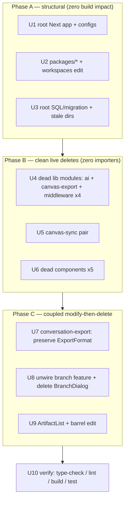

# refactor: Remove dead and duplicate code (audit cleanup)

## Summary

A repo-wide ponytail audit found ~15k lines of code that is never built, never imported, or duplicated. The single live application is the `apps/web` workspace (`vercel.json` → `apps/web/.next`; all root scripts delegate `--workspace=apps/web`). Everything this plan deletes is either outside that build path or has zero importers inside it, re-confirmed by grep.

Scope (user-confirmed): orphaned root Next app, orphan `packages/*` stubs, root SQL/migration scaffolding, stale staging dirs, and grep-verified dead modules inside `apps/web`. **Out of scope:** the four `.bmad-*` bundles (separate decision), `docs/` (actively edited), and the flatten/native refactors from the audit (real risk — deferred to follow-up).

The work is dependency-ordered into four phases: zero-risk structural deletes first (cannot affect the build), then clean live-code deletes, then three coupled modify-then-delete units, then a single verification gate.

---

## Problem Frame

The repo accreted a pre-monorepo Next app, four orphan workspace stubs, one-shot SQL/migration helpers, scratch directories, and a layer of dead modules inside the live tree (unused exporters, summarizers, search services, a never-activated branch feature, duplicate error/skeleton components). None of it ships; all of it raises read cost and search noise, and the dead live-tree modules masquerade as real features. The goal is deletion with proof, not refactoring — remove what the build and the import graph already prove is unused, and verify the build stays green.

---

## Requirements

- **R1** — Remove the orphaned root Next app and its dead root configs without affecting the `apps/web` build.
- **R2** — Remove the four orphan `packages/*` workspaces and stop declaring them in the root `package.json`.
- **R3** — Remove root SQL/migration scaffolding and stale staging directories (`archived/`, `naming-project/`, `plans/`, `todos/`).
- **R4** — Delete grep-verified dead modules in `apps/web/lib` and `apps/web` components, including any test that travels with a deleted module.
- **R5** — For the three coupled cases (`conversation-export`, branch feature, `ArtifactList`), preserve every still-live consumer while removing the dead code.
- **R6** — After cleanup, `type-check`, `lint`, `build`, and the test suite all pass with no broken imports.

**Traceability:** every Implementation Unit cites the R-IDs it advances. R6 is the global gate (U10).

---

## Key Technical Decisions

- **KTD1 — `apps/web` is the only live build; treat the root Next app as dead.** Build output is `apps/web/.next`; `apps/web/tsconfig.json` does not `extends` the root tsconfig and `apps/web/eslint.config.mjs` extends `next/*`, not root. Root `next.config.ts`/`middleware.ts`/`index.html`/`tsconfig.json`/`eslint.config.mjs`/`postcss.config.mjs` are unreferenced. Last touched 2025-09-25 vs `apps/web` 2026-06-15. → Delete the root app and root configs (U1).
- **KTD2 — Delete dead code, do not "deprecate" it.** No `@deprecated` tombstones, no commented-out blocks, no keep-for-later shims. Git history is the archive. Anything genuinely needed later is recoverable from the commit that removes it.
- **KTD3 — Re-verify zero importers at delete time, per unit.** The dead-module list was grep-confirmed during planning, but the implementer must re-run the importer check immediately before each delete (the import graph can shift between plan and execution). Verification command is in each unit.
- **KTD4 — Coupled deletes preserve the live consumer first, then remove.** `conversation-export.ts` is deleted only after relocating the `ExportFormat` type that `ExportDialog` imports (U7). The branch feature is unwired from `StreamingMessage`/`MessageActionMenu` before `BranchDialog` is deleted (U8). `ArtifactList` is removed from the barrel before the file is deleted (U9).
- **KTD5 — Keep `tsconfig.tsbuildinfo` out of scope.** It is an untracked build artifact (not git-tracked), not a plan target.

---

## High-Level Technical Design

Dependency order — safe-first. Phases A and B cannot break the build (deleted code is not built or not imported). Phase C edits live files. Phase D is the gate.

Phases A and B units are independent of each other and may land in any internal order or be batched; phase C units are independent of each other but all depend on B being green. U10 runs last.

---

## Implementation Units

### U1. Remove orphaned root Next app and dead root configs

**Goal:** Delete the pre-monorepo Next app at the repo root.
**Requirements:** R1
**Dependencies:** none
**Files (delete):** `app/` (whole tree), `lib/` (whole tree), `middleware.ts`, `next.config.ts`, `index.html`, `tsconfig.json`, `eslint.config.mjs`, `postcss.config.mjs`
**Approach:** These are the root-level siblings of `apps/`, not the `apps/web/*` equivalents. Confirm before deleting that no `apps/web` file imports from the root `app/` or `lib/` (none found in planning). Leave the root `package.json` (workspace root), `README.md`, `AGENTS.md`, `CLAUDE.md`, `STRATEGY.md`, and other active root docs untouched.
**Verification command:** `rg -n "from ['\"].*\.\./\.\./\.\./(app|lib)/" apps/web` returns nothing; then `npm run build` still succeeds (proves root next.config/middleware were unused).
**Test scenarios:** `Test expectation: none -- pure deletion of non-built files; covered by U10 build gate.`
**Verification:** `git status` shows only deletions; `npm run build` green.

### U2. Remove orphan `packages/*` workspaces

**Goal:** Delete the four stub packages and stop declaring them as workspaces.
**Requirements:** R2
**Dependencies:** none
**Files (delete):** `packages/bmad-engine/`, `packages/canvas-engine/`, `packages/shared/`, `packages/ui/`
**Files (modify):** `package.json` — remove `"packages/*"` from the `workspaces` array, leaving `["apps/*"]`.
**Approach:** No `apps/web` file imports `@thinkhaven/*` or any of these package names (grep-confirmed zero). `bmad-engine`/`canvas-engine` `index.ts` even re-export from subfiles that do not exist, so they could never have built. After editing `workspaces`, a fresh `npm install` must not warn about a missing workspace.
**Verification command:** `rg -n "@thinkhaven/|packages/(bmad-engine|canvas-engine|shared|ui)" apps/web` returns nothing.
**Test scenarios:** `Test expectation: none -- orphan removal; covered by U10 (npm install + build).`
**Verification:** `npm install` clean; `npm run build` green.

### U3. Delete root SQL/migration scaffolding and stale staging dirs

**Goal:** Remove one-shot ops helpers and scratch directories.
**Requirements:** R3
**Dependencies:** none
**Files (delete):** `CHECK-MIGRATION-STATUS.sql`, `CHECK-RLS-POLICIES.sql`, `SAFE-UPDATE-MIGRATION-005.sql`, `VERIFY-CURRENT-STATE.sql`, `RUN-MIGRATION-007.md`, `RUN-MIGRATIONS.sh`, `READY-TO-LAUNCH.md`, `archived/`, `naming-project/`, `plans/`, `todos/`
**Approach:** Real migrations live under `supabase/` — leave that untouched. The root `plans/` (2 files) is distinct from `docs/plans/` where this plan lives; do not touch `docs/`. Confirm none of these files are referenced by any script in `package.json`, `apps/web/package.json`, or `.github/workflows/`.
**Verification command:** `rg -n "RUN-MIGRATIONS|READY-TO-LAUNCH|CHECK-MIGRATION|naming-project|^archived/" .github package.json apps/web/package.json` returns nothing.
**Test scenarios:** `Test expectation: none -- non-code scaffolding; no build surface.`
**Verification:** `git status` shows only deletions; CI config still valid.

---

### U4. Delete clean-dead `lib` modules (ai + canvas-export + middleware variants)

**Goal:** Remove lib modules with zero importers across `apps/web`.
**Requirements:** R4
**Dependencies:** U1–U3 landed (keeps the working tree readable; not a hard code dependency)
**Files (delete):** `apps/web/lib/ai/conversation-summarizer.ts` (438), `apps/web/lib/ai/conversation-search.ts` (349), `apps/web/lib/ai/context-manager.ts` (274), `apps/web/lib/canvas/canvas-export.ts` (518) + its test `apps/web/tests/canvas/canvas-export.test.ts`, `apps/web/lib/supabase/middleware.ts`, `apps/web/lib/supabase/middleware-minimal.ts`, `apps/web/lib/supabase/middleware-simple.ts`, `apps/web/lib/supabase/middleware-edge.ts` (322 total)
**Approach:** All four `middleware*.ts` export `updateSession`; none is imported, and the active `apps/web/middleware.ts` inlines `createServerClient` directly. `canvas-export.ts` is superseded by the live `lib/export/canvas-export-md.ts`. The three `lib/ai` modules have zero non-test importers.
**Verification command (run per file before deleting):** `rg -n "/<module-stem>['\"]" --type ts --type tsx apps/web | rg -v "<the file itself>|\.test\."` returns nothing.
**Patterns to follow:** none — deletion only.
**Test scenarios:** `Test expectation: none -- dead modules with no live consumer; the one traveling test (canvas-export.test.ts) is deleted with its module. Global coverage via U10.`
**Verification:** `npm run type-check` green (no unresolved imports surface).

### U5. Delete dead canvas-sync pair

**Goal:** Remove the canvas-sync hook and the parser that feeds only it.
**Requirements:** R4
**Dependencies:** none (orthogonal to U4)
**Files (delete):** `apps/web/lib/canvas/useCanvasSync.ts` (230), `apps/web/lib/canvas/visual-suggestion-parser.ts` (405) + its test `apps/web/lib/canvas/__tests__/visual-suggestion-parser.test.ts`
**Approach:** `visual-suggestion-parser` has exactly one importer — `useCanvasSync` — and `useCanvasSync` has zero importers. They are dead as a unit. Delete the hook and parser together; the parser test goes with them.
**Verification command:** `rg -n "useCanvasSync['\"]" --type ts --type tsx apps/web` returns nothing (the hook is the only thing that referenced the parser).
**Test scenarios:** `Test expectation: none -- dead pair; parser test removed with the pair. Global coverage via U10.`
**Verification:** `npm run type-check` green.

### U6. Delete clean-dead components

**Goal:** Remove components with zero render sites and zero importers.
**Requirements:** R4
**Dependencies:** none
**Files (delete):** `apps/web/app/components/ui/LoadingSkeleton.tsx` (293), `apps/web/app/components/dual-pane/StateBridge.tsx` (154), `apps/web/app/components/ui/ErrorBoundary.tsx` (144), `apps/web/app/components/ui/OfflineNotice.tsx` (33), `apps/web/components/ui/separator.tsx` (28)
**Approach:** `LoadingSkeleton` is superseded by a local `DashboardSkeleton` in `app/app/page.tsx`; `ErrorBoundary` is superseded by the live `PaneErrorBoundary`; `OfflineNotice` is a dead duplicate of the rendered `OfflineIndicator`; `StateBridge` and `separator` have no importers. Confirm each has neither an import nor a JSX tag anywhere in `apps/web`.
**Verification command (per component):** `rg -n "<ComponentName>|/<ComponentName>['\"]" --type tsx --type ts apps/web | rg -v "\.test\."` returns nothing.
**Test scenarios:** `Test expectation: none -- unrendered components. Global coverage via U10.`
**Verification:** `npm run type-check` and `npm run build` green.

---

### U7. Remove `ConversationExporter`, preserve the `ExportFormat` type

**Goal:** Delete the unused exporter class while keeping the one type a live component needs.
**Requirements:** R4, R5
**Dependencies:** Phase B green
**Files (modify):** `apps/web/app/components/chat/ExportDialog.tsx` — it imports only `ExportFormat` (a string-union type) from `@/lib/ai/conversation-export`. Relocate that type: either inline the union into `ExportDialog.tsx` or move it to a small shared type module, and update the import.
**Files (delete):** `apps/web/lib/ai/conversation-export.ts` (631) + its test `apps/web/tests/lib/ai/conversation-export.test.ts`
**Approach:** The `ConversationExporter` class, its `createConversationExporter` factory, and the export-execution logic are unused — the live export path is `lib/export/chat-export.ts` and the `/api/chat/export` route. `ExportDialog` needs only the `ExportFormat` union and defines its own `ExportFormatInfo` locally. Move the union, drop the rest, delete the now-orphaned test.
**Patterns to follow:** keep the union next to its consumer or in `lib/artifact/artifact-types.ts`-style co-located types; mirror existing type-only exports.
**Test scenarios:**
- Covers R5. ExportDialog still type-checks and renders its format options after the type move — the `selectedFormat` state and `handleFormatChange` still accept every member of the relocated union.
- The export flow still completes end-to-end (ExportDialog → `/api/chat/export`) — the deletion touched no runtime export path.
**Verification:** `npm run type-check` green; ExportDialog renders and an export succeeds in the running app.

### U8. Remove the inactive branch feature

**Goal:** Delete `BranchDialog` and unwire the never-activated branch path that threads to it.
**Requirements:** R4, R5
**Dependencies:** Phase B green
**Files (delete):** `apps/web/app/components/chat/BranchDialog.tsx` (275)
**Files (modify):** `apps/web/app/components/chat/StreamingMessage.tsx` — remove the `onCreateBranch` prop (and `conversationId`/`conversationTitle` if they have no remaining consumer after branch removal); `apps/web/app/components/chat/MessageActionMenu.tsx` — remove the `onCreateBranch` prop and the branch-trigger button JSX.
**Approach:** The chain is `StreamingMessage` → `MessageActionMenu` (branch button) → `BranchDialog`. The real render sites (`ChatInterface`, `GuestChatInterface`) never pass `onCreateBranch` — only tests do. Remove the prop threading and the dialog. **Scope guard:** touch only the branch path. `onCreateReference`/`onViewReferences`/`onBookmark` in the same components are separate; leave them unless independently proven dead. After removing branch props, check whether `conversationId`/`conversationTitle` are still read anywhere in `StreamingMessage`/`MessageActionMenu`; remove them only if orphaned.
**Patterns to follow:** the surrounding action-menu props (`onBookmark`, etc.) show the existing optional-callback shape to preserve.
**Test scenarios:**
- Covers R5. `MessageActionMenu` still renders bookmark/reference actions after the branch button is removed — non-branch actions are untouched.
- `StreamingMessage` renders for both streaming and complete states with no `onCreateBranch` in scope — no reference-to-undefined.
- Any test that passed `onCreateBranch`/`BranchDialog` props is removed or updated, not left asserting deleted behavior.
**Verification:** `npm run type-check` and test suite green; the chat message action menu still works in the running app, with no branch option.

### U9. Delete `ArtifactList` and update the artifact barrel

**Goal:** Remove the unrendered `ArtifactList` and its barrel re-export.
**Requirements:** R4, R5
**Dependencies:** Phase B green
**Files (modify):** `apps/web/app/components/artifact/index.ts` — remove the `export { ArtifactList } from './ArtifactList';` line.
**Files (delete):** `apps/web/app/components/artifact/ArtifactList.tsx` (101)
**Approach:** `ArtifactList`'s only reference is the barrel re-export; no `<ArtifactList>` is rendered anywhere. Remove the barrel line first, then delete the file. Leave the rest of the barrel intact — flattening the barrel (the audit's `wrapper` finding) is deferred follow-up, not this unit.
**Verification command:** after the barrel edit, `rg -n "ArtifactList" apps/web | rg -v "\.test\."` returns nothing.
**Test scenarios:**
- Covers R5. The artifact barrel's other consumers (`Artifact`, `ArtifactPanel`, `ArtifactKeyboardHandler`) still resolve their imports after the `ArtifactList` line is removed.
**Verification:** `npm run type-check` and `npm run build` green.

---

### U10. Verification gate

**Goal:** Prove the cleanup left the app fully green.
**Requirements:** R6
**Dependencies:** U1–U9
**Files:** none (verification only)
**Approach:** Run the full quality suite from the repo root and resolve any fallout before considering the work done. Expected fallout is limited to deleted-module test files (already removed in their units) and stray imports the per-unit checks missed.
**Verification:**
- `npm install` — clean, no missing-workspace warning (validates U2).
- `npm run type-check` — no unresolved imports or dangling references.
- `npm run lint` — clean.
- `npm run build` — `apps/web` builds (validates U1: root next.config/middleware were unused).
- `npm test` (or `npm run test --workspace=apps/web`) — suite green; no test references a deleted module.
**Test scenarios:** this unit *is* the test pass. `Covers R6.`

---

## Scope Boundaries

**In scope:** the deletions and minimal edits in U1–U9, verified by U10.

### Deferred to Follow-Up Work
- **`.bmad-*` bundles** (~37.6k lines across four directories) — removal is a separate decision pending confirmation that BMAD is not invoked from this repo.
- **Flatten/native refactors from the audit** — `auth-metrics`/`alert-service` class-to-function flattening, the hand-rolled `popover.tsx`/`MessageActionMenu` dropdown → Radix swap, `AuthLogger`/`EnvironmentValidator` flattening, `ArtifactHeader` inline-SVG → lucide, and barrel flattening. These change live behavior or add/remove a dependency — real risk, out of a pure-deletion plan.
- **`openrouter-client.ts`** — referenced as a synthesis fallback in `model-config.ts`; a real feature, not dead. Not touched.

### Out of scope (not cleanup targets)
- `docs/` (~80k lines) — actively edited.
- Active root docs: `README.md`, `AGENTS.md`, `CLAUDE.md`, `STRATEGY.md`, `PRODUCT.md`, `PROJECT.md`, `DESIGN.*`, `GEMINI.md`, `SECURITY.md`, `TESTING-GUIDE.md`.
- `supabase/` migrations.
- `tsconfig.tsbuildinfo` — untracked build artifact, not a git target.

---

## Risks & Dependencies

- **R-risk1 — Import graph drift between plan and execution.** Mitigation: KTD3 requires a per-unit zero-importer re-check immediately before each delete (commands embedded in U4–U9).
- **R-risk2 — Coupled deletes break a live consumer.** Mitigation: U7–U9 are explicitly modify-then-delete with the live consumer preserved first; each carries a render/type-check scenario.
- **R-risk3 — A deleted module is referenced only dynamically (string import, route convention).** Low for these targets (all are static ESM imports), but U10's `build` + `type-check` + test run is the backstop.
- **R-risk4 — `npm install` warns after removing `packages/*` from `workspaces`.** Mitigation: U2 edits the array and U10 re-runs `npm install` clean.
- **Sequencing dependency:** Phase A → B → C → D. Within A and B, units are independent. Phase C units are mutually independent but all require B green.

---

## Sources & Research

- Ponytail repo-wide audit (this session, 2026-06-22) — surfaced the candidate set.
- Planning-time grep verification (this session) corrected three audit "clean delete" claims to coupled modify-then-delete: `conversation-export` (`ExportDialog` imports the `ExportFormat` type), `BranchDialog` (branch props thread through `StreamingMessage`/`MessageActionMenu`), `ArtifactList` (re-exported by the artifact barrel). These corrections are encoded in U7–U9.
- Build-path evidence: `vercel.json` (`outputDirectory: apps/web/.next`), root `package.json` (all scripts delegate `--workspace=apps/web`), `apps/web/tsconfig.json` (no root `extends`), `apps/web/middleware.ts` (inlines `createServerClient`).
