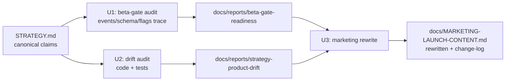

# feat: Execute three GTM/strategy briefs — beta-gate audit, drift audit, marketing rewrite

## Goal Capsule

Produce three durable repo artifacts that close the gap between STRATEGY.md (2026-06-10) and the rest of the project: (1) a beta-gate instrumentation readiness report, (2) a strategy→product drift audit with test-backed verdicts, (3) a rewritten `docs/MARKETING-LAUNCH-CONTENT.md` aligned to the current ICP and grounded in what the audits confirm actually ships. Audits are read-only on product code; the only product-file mutation is the marketing doc rewrite plus two new report files.

---

## Problem Frame

STRATEGY.md moved the product to a fractional-operator/advisor ICP and an open method-kit track. Monetization is gated at 60% engagement / 50% WTP / 40% output portability — thresholds that live only in project memory (roadmap-state beta-gate criteria, 2026-04), not in any repo document; STRATEGY.md's key metrics carry no percentages. Three things have not caught up:

1. Nobody has verified the product can **measure** the three gate metrics.
2. Nobody has verified the shipped code still **enforces** STRATEGY.md's three core promises (adversarial board, artifact-gated close, anti-sycophancy) after the ~15k-line dead-code purge (PR #43).
3. `docs/MARKETING-LAUNCH-CONTENT.md` (611 lines) still sells the Nov-2025 single-persona, assessment-first, $25 product — contradicting the strategy.

The three deliverables are dependency-ordered: the audits establish what is true; the marketing rewrite may only claim what the audits confirm.

---

## Requirements

- **R1** — Beta-gate readiness report at `docs/reports/2026-07-05-beta-gate-readiness.md`: each gate metric classified MEASURABLE-NOW / NEEDS-SMALL-CHANGE / NOT-INSTRUMENTED with the concrete event, table, or query backing each verdict, plus a ranked minimal instrumentation plan and a go/no-go read on current data.
- **R2** — Drift audit report at `docs/reports/2026-07-05-strategy-product-drift.md`: a table of STRATEGY.md claims → enforcing code (file:line) → covering test (file:line) → verdict {CONFIRMED | WEAK | MISSING}, with a fix list ordered by strategy impact. CONFIRMED requires a test actually run and passing.
- **R3** — `docs/MARKETING-LAUNCH-CONTENT.md` rewritten: 3–5 LinkedIn posts (each ≤1,248 chars, distinct angles), one-line positioning + 2–3 sentence description, channel plan (LinkedIn + HealthTechNerds + Lenny's, no custom Slacks), and a change-log section mapping old→new framing.
- **R4** — Honesty constraints hold everywhere: no fabricated metric values; no paid tier presented as live; marketing claims about *current shipped behavior* ("the product does X") trace to a U2 CONFIRMED row, while STRATEGY.md alone licenses only vision/positioning or future-framed language; human-judgment calls (WTP/portability proxy definitions, WEAK/MISSING fixes, the primary hook) are flagged for Kevin's review inside the artifacts, not silently decided as final.
- **R5** — Voice constraints hold in the marketing doc: zero banned words (per global CLAUDE.md list), no AI attribution, direct conclusion-first tone.

---

## Key Technical Decisions

- **KTD1 — Audits before rewrite.** U3 (marketing) depends on U1+U2 output so every product claim in the new copy cites a confirmed feature or STRATEGY.md, not memory. This is the single load-bearing sequencing decision.
- **KTD2 — Verdicts from code and schema tracing, not live prod data.** Pipeline mode has no guaranteed prod PostHog/DB access. MEASURABLE-NOW verdicts are backed by a written, runnable query or a named event that provably fires (code path cited). If the Supabase MCP or local env permits an actual query, run it; otherwise mark "query provided, not executed" — never invent a number (R4).
- **KTD3 — Prompt text is not enforcement.** In U2, a CONFIRMED verdict requires a mechanism (tool schema, control flow, gate) plus a green test that would fail if the logic broke. Prompt wording alone caps at WEAK. This mirrors the repo learning that agreement/assertion is not verification (`docs/solutions/workflow-issues/multi-reviewer-agreement-is-not-independence.md`).
- **KTD4 — Human checkpoints become flagged sections, not blockers.** The source briefs specify interactive checkpoints (approve hook, confirm proxies, review WEAK list). Pipeline mode cannot block, so each artifact carries an explicit "Kevin's call" section marking those decisions as provisional (R4).
- **KTD5 — Rewrite in place.** `docs/MARKETING-LAUNCH-CONTENT.md` is replaced, not siblinged — git history preserves the old version; a parallel stale file would recreate the drift this work exists to kill.

---

## High-Level Technical Design

Audit surface (read-only): `apps/web/lib/analytics/events.ts` (typed event union + `track()`), `apps/web/app/providers.tsx` (PostHog init/masking), `apps/web/lib/monetization/credit-manager.ts` (`CREDIT_SYSTEM_ENABLED`), `apps/web/lib/session/message-limit-manager.ts` (`MESSAGE_LIMIT_ENABLED`), `apps/web/lib/session/session-primitives.ts` (session lifecycle), `apps/web/app/share/[token]/` + `apps/web/app/api/artifact/share/` + `apps/web/supabase/migrations/033_public_artifacts.sql` (portability), `apps/web/supabase/migrations/{027,030}_*.sql`, `apps/web/lib/ai/board-members.ts`, `apps/web/lib/ai/tools/session-tools.ts`, `apps/web/app/api/chat/stream/route.ts`, `apps/web/lib/ai/mary-persona.ts` (anti-sycophancy prompt surface).

---

## Assumptions

Pipeline mode — these Inferred bets proceed without chat confirmation; each is also flagged inside the artifact it affects:

- **A1** — WTP proxy and "output portability" proxy definitions are drafted by the implementer and marked provisional pending Kevin's confirmation (portability default: share-link creation or export per completed session; WTP default: any explicit payment-intent signal available in schema/analytics — if none exists, WTP is NOT-INSTRUMENTED).
- **A2** — The new primary marketing hook targets the STRATEGY.md primary ICP (fractional operators/independent advisors); it ships marked "provisional — Kevin approves before posting." Nothing is published externally by this work.
- **A3** — Live prod queries are optional (KTD2); the audit is complete without them as long as every verdict cites code, schema, or a runnable query.
- **A4** — 5–8 testable claims extracted from STRATEGY.md is the right granularity for U2 (the three headline promises decompose into per-mechanism claims).

---

## Scope Boundaries

**In scope:** the three artifacts above; running the existing unit suite (or targeted subsets) to back CONFIRMED verdicts.

**Out of scope:** implementing any instrumentation fix U1 proposes; fixing any WEAK/MISSING gap U2 finds; posting content externally; touching PostHog config, flags, migrations, or any runtime code; pricing/packaging decisions.

### Deferred to Follow-Up Work

- Instrumentation changes from U1's ranked plan (own PR, after Kevin confirms proxy definitions).
- Enforcement fixes from U2's fix list (own PR(s), after Kevin reviews verdicts).
- Landing/onboarding copy realignment (`/`, `/try`, `/demo`, `/assessment`) — adjacent to U3 but a separate surface.
- SignupPromptModal honest-copy regression (already tracked in project memory; do not fold in here).

---

## Implementation Units

### U1. Beta-gate instrumentation readiness audit

**Goal:** Determine whether engagement (60%), WTP (50%), and output portability (40%) are measurable today, and write the readiness report.

**Requirements:** R1, R4.

**Dependencies:** none.

**Files:** create `docs/reports/2026-07-05-beta-gate-readiness.md`. Read-only: `apps/web/lib/analytics/events.ts`, `apps/web/app/providers.tsx`, `apps/web/lib/monetization/credit-manager.ts`, `apps/web/lib/session/message-limit-manager.ts`, `apps/web/lib/session/session-primitives.ts`, `apps/web/app/api/artifact/share/`, `apps/web/supabase/migrations/027_credit_system_activation.sql`, `apps/web/supabase/migrations/030_beta_operations.sql`, `apps/web/supabase/migrations/033_public_artifacts.sql`.

**Approach:** State the gates' provenance up front: the 60/50/40 thresholds come from project memory, not a repo document — the report must say so, and the "Kevin's call" section must ask whether they are still his bar and whether to codify them into STRATEGY.md. Include a reconciliation table mapping each gate metric onto STRATEGY.md's actual key metrics (engagement → repeat advisor usage / completed pressure tests; portability → artifact share-out; WTP → paid conversion). Then write a precise definition (numerator/denominator) for each gate metric and trace whether the event/table for each term exists. Note: the typed `TrackedEvent` union in `events.ts` is the authoritative inventory of client analytics — enumerate it rather than grepping for `capture` calls. Classify each metric; for gaps, name the smallest instrumentation change (new event, new column, or a query over existing tables). Rank gaps by effort. Close with the go/no-go read: what current data can and cannot support. Flag proxy definitions per A1.

**Execution note:** Read-only on product code. Prefer writing runnable SQL/PostHog queries into the report over executing against prod (KTD2).

**Test scenarios:** Test expectation: none — read-only audit producing a markdown report; verification is citation-completeness, not unit tests.

**Verification:** Every MEASURABLE-NOW verdict names an event in the `TrackedEvent` union or a table/column in a cited migration, plus a runnable query. Client-event-backed verdicts carry an explicit caveat that they are conditional on PostHog initializing with a valid key in the prod environment (unverifiable from code alone) — listed as an environmental assumption in "Kevin's call". Every gap has a paired smallest-fix. No numeric metric value appears unless a query was actually executed (state where it ran). "Kevin's call" section flags both proxy definitions and the threshold provenance question.

### U2. Strategy→product drift audit

**Goal:** Verify the shipped code still enforces STRATEGY.md's promises; write the drift report with test-backed verdicts.

**Requirements:** R2, R4.

**Dependencies:** none (parallel with U1).

**Files:** create `docs/reports/2026-07-05-strategy-product-drift.md`. Read-only: `STRATEGY.md`, `apps/web/lib/ai/board-members.ts`, `apps/web/lib/ai/tools/session-tools.ts`, `apps/web/app/api/chat/stream/route.ts`, `apps/web/lib/ai/mary-persona.ts`, `apps/web/lib/session/session-primitives.ts`, `apps/web/app/share/[token]/`, plus covering tests under `apps/web/tests/`, which mirrors source structure (e.g., `tests/lib/ai/`, `tests/lib/session/`, `tests/api/`); also grep `tests/` for mechanism names like `switch_speaker` before issuing a MISSING verdict.

**Approach:** Extract 5–8 testable claims from STRATEGY.md (per A4): adversarial multi-perspective board, session-close artifact gate, anti-sycophancy, plus per-mechanism sub-claims (e.g., `switch_speaker` tool-call routing, challenge-loop phase progression, share-artifact path). For each: locate the enforcing mechanism (file:line), find the covering test (file:line), apply the KTD3 bar (mechanism + green test → CONFIRMED; prompt-only → WEAK; nothing → MISSING). Run the cited tests via the unit suite from `apps/web` (`npm run test:run`, or targeted file runs) and record results. Order the fix list by strategy impact, not code locality.

**Execution note:** The unit suite baseline is green (61 files / 528 tests); any pre-existing failure encountered is reported as-is, not fixed here. `npx tsc`/test runs must execute from `apps/web`, not repo root.

**Test scenarios:** Test expectation: none — this unit *runs* existing tests as evidence but adds none; the report is the deliverable.

**Verification:** Every verdict row has a file:line anchor. Every CONFIRMED cites a test that was executed in this run and passed (command + result recorded in the report), plus a one-line falsification note naming the specific assertion that would fail if the enforcing mechanism were removed or bypassed — if no such assertion can be named, the verdict downgrades to WEAK (a passing non-discriminating test is not enforcement evidence). No verdict rests on prompt text alone. "Kevin's call" section flags the WEAK/MISSING fix list as pending his review.

### U3. GTM marketing content rewrite

**Goal:** Replace the stale body of `docs/MARKETING-LAUNCH-CONTENT.md` with strategy-aligned content grounded in U1/U2 findings.

**Requirements:** R3, R4, R5.

**Dependencies:** U1, U2.

**Files:** modify `docs/MARKETING-LAUNCH-CONTENT.md` (in-place replacement per KTD5). Read-only: `STRATEGY.md`, `docs/prd/8-strategic-direction.md`, both U1/U2 reports, `apps/web/app/page.tsx` and sibling public routes (`/try`, `/demo`, `/assessment`) to confirm live surfaces.

**Approach:** (1) Diff STRATEGY.md against the current doc; enumerate every stale claim (single-persona framing, assessment-first funnel, $25 checkout, "ready to go" launch state). (2) Draft the fractional-operator primary hook (provisional per A2). (3) Write 3–5 LinkedIn posts on distinct angles — the peer-board problem, the open method kit, the defensible artifact — plus positioning lines and the channel plan. (4) Compliance pass: char counts per post (hard ≤1,248), banned-word scan, claim-traceability check (current-behavior claims → U2 CONFIRMED rows only; STRATEGY.md licenses vision/future-framed language only — any promise U2 rated WEAK or MISSING must be future-framed or omitted), monetization language check against U1's gate status (nothing sold as live). (5) Append the old→new change-log.

**Execution note:** Run the char counts and banned-word scan mechanically (script or shell one-liners), not by eyeball; record the counts in the change-log section.

**Test scenarios:** Test expectation: none — docs-only content change; verification is the mechanical compliance pass below.

**Verification:** All posts measured ≤1,248 chars with counts recorded. Banned-word scan over the final doc returns zero hits (check substring traps: `utilize` inside `underutilized`, all `leverage` forms). Every current-behavior claim maps to a U2 CONFIRMED row; vision/positioning claims may cite STRATEGY.md but must be framed as direction, not shipped capability; every monetization mention is future-framed. Change-log section present. Hook marked provisional.

---

## Verification Contract

- Both reports exist at their `docs/reports/` paths and pass their unit-level verification checks above.
- `docs/MARKETING-LAUNCH-CONTENT.md` passes the mechanical compliance pass (char counts, banned words, traceability) with evidence recorded in the doc.
- `git diff` touches only: the two new report files, the rewritten marketing doc, and this plan's tracking artifacts. Zero changes under `apps/web/` (read-only invariant, R4).
- Any test executions for U2 ran from `apps/web` and their outcomes are quoted in the drift report.

## Definition of Done

Three artifacts on disk meeting R1–R5, read-only invariant intact, every human-judgment call flagged in a "Kevin's call" section rather than silently finalized, and the work committed on a branch ready for PR.

---

## Risks & Dependencies

- **Risk: fabrication pressure in U1.** If schema/events are thin, the tempting move is a plausible percentage. Mitigation: KTD2's hard rule — no number without an executed query; NOT-INSTRUMENTED is a valid, expected verdict.
- **Risk: U2 over-crediting prompts.** Board/anti-sycophancy behavior lives partly in prompt text. Mitigation: KTD3 caps prompt-only evidence at WEAK.
- **Risk: U3 voice drift.** Marketing copy is the highest banned-word-density genre. Mitigation: mechanical scan required, not optional.
- **Dependency: none external.** No MCP, no network, no prod access required for the minimum bar (A3).

## Sources & Research

- `STRATEGY.md` (2026-06-10) — canonical product claims and key metrics (no percentage thresholds).
- `docs/prd/8-strategic-direction.md` — two-tier model, competitive frame.
- Project memory (roadmap-state, 2026-04) — sole source of the 60/50/40 beta-gate thresholds; also flags, green-test baseline, PR #43 purge. Threshold values are carried in this plan's Problem Frame so the executor does not depend on memory access.
- `docs/solutions/workflow-issues/multi-reviewer-agreement-is-not-independence.md` — evidence bar for KTD3.
- Repo verification this session: all cited file paths confirmed present; `docs/reports/` exists; analytics inventory lives in the typed union at `apps/web/lib/analytics/events.ts`.
